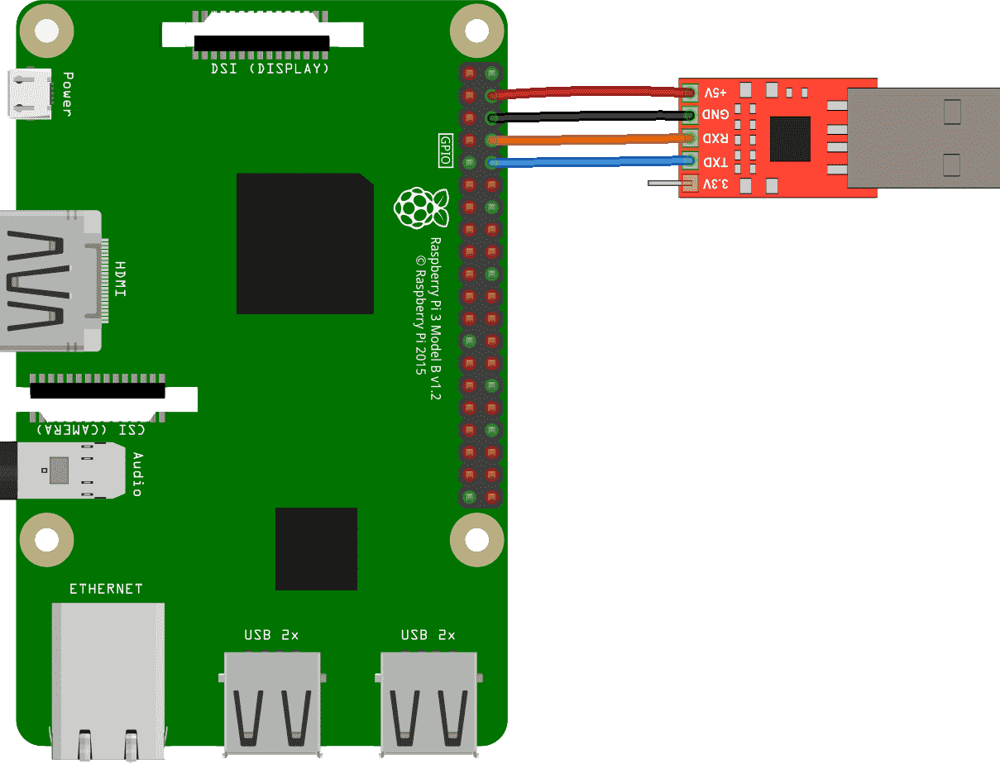

# OSH 大作业

## 成员
- 刘云飞 PB17051044
- 李维晟 PB17000100
- 汪若辰 PB17000098
- 余磊 PB17051053

## 项目
### A. [Final] Implementing an OS for Raspberry Pi 3 in Rust
### B. Enhanced Distributed File System


## 记录
- 3.20 [第一次讨论](discussion/20190320.md)初步分析两个项目；
- 3.27 ~ 3.31 完成[调研报告](docs/research.md)；
- 4.3 [第二次讨论](discussion/20190403.md)确定可行性报告内容和分工；

- 4.3 ~ 4.9 完成[可行性报告](docs/feasibility.md)；

- 4.24 [中期汇报](docs/mid_term_report.pptx)；

## 课程规划

（来自[隔壁小组](https://github.com/OSH-2019/x-rust-freertos/blob/master/README.md)）

- 第一二周：提交分组名单与初拟题目
- 第三周：第一次作业（作业+实验0）
- 第二周与第三周：确认选题，开始调研
- 第四周与第五周：正式提交项目选题，提交调研报告（即总体设计报告第一部分)
  1. *调研报告：项目背景、立项依据、前瞻性/重要性分析、相关工作（科研和工业界）（十五页）*
- 第五周：第二次作业（作业+实验1）
- 第五周及第六周：设计报告第二部分：可行性报告
  1. *可行性报告：可行性分析，包括理论依据、技术依据、创新点（10页)*
  2. *概要设计报告*
- 第七周：第三次作业（作业+实验2)
- 第八周：中期汇报
- 第九周：前三次实验检查
- 第11周：第四次作业（作业+实验3）
- 第16周：期末考试
- 第17及18周：项目检查与实验3检查

## Get Started

### 软硬件环境

#### 硬件

- 树莓派 3B+
- CP2102 USB to TTL 转接线
- Micro SD 卡
- 读卡器

#### 软件

安装 Rust

```
curl https://sh.rustup.rs -sSf | sh
```

更改 Rust 工具链版本

```
cargo install --version 0.3.10 xargo
rustup default nightly-2018-01-09
rustup component add rust-src
```

### 安装 aarch64-none-elf 工具

``` bash
wget https://cs140e.sergio.bz/files/aarch64-none-elf-linux-x64.tar.gz
tar -xzvf aarch64-none-elf-linux-x64.tar.gz
```

将`aarch64-none-elf/bin`目录添加到`PATH`环境变量即可。

### 安装 ttywrite 工具

``` bash
cd cs140e/1-shell/ttywrite
cargo install
```

> 若出现类似`error: non-string literals in attributes, or string literals in top-level positions, are experimental`的错误，需按照提示在某文件中添加`#![feature(attr_literals)]`。要添加这一行的文件需要根据报错的文件位置来确定，具体方法为，若报错的文件为`*/src/../..*rs`，则在`*/src/lib.rs`中添加`#![feature(attr_literals)]`。若下文中出现同样报错，再次按此操作即可。

### 在 Micro SD 中放入启动必需文件

启动必需文件有 4 个：`start.elf`, `bootcode.bin`, `config.txt`,  `kernel8.img`。

从 https://github.com/raspberrypi/firmware/tree/master/boot 下载`start.elf`和`bootcode.bin`文件，新建文本文件`config.txt`，内容如下：

```
kernel_address=0x4000000
device_tree=
```

获取`kernel8.img`：

``` bash
cd cs140e/os/bootloader
make
cp build/bootloader.bin kernel8.img
```

> 也可以在`cs140e/os/files_used_to_boot`文件夹下直接找到这 4 个文件。

把 Micro SD 卡用 MBR 分区表建立一个 FAT32 分区，将这 4 个文件放入分区根目录内。

### 连接设备

Micro SD 卡插入树莓派中，使用 USB to TTL 转接线将树莓派和电脑相连，连接方式如下。



### 运行

进入`/dev`文件夹，找到`ttyUSB`开头的一项，记下这个名字，然后将`cs140e/os/kernel/Makefile`中`PI_TTY ?= /dev/ttyUSB0`做相应修改。

在`kernel`目录下执行命令：

``` bash
make install
```

> 如果出现访问`/dev/ttyUSB*`权限不足的问题，需要将您当前的用户添加到`/dev/ttyUSB*`所在组`diaout`内：`sudo adduser your_user_name dialout`（替换`your_user_name` ）。

待传输完成后，执行命令：

``` bash
screen /dev/ttyUSB0 115200 # if your TTY device differs, modify ttyUSB0 appropriately.
```

Enjoy it!

