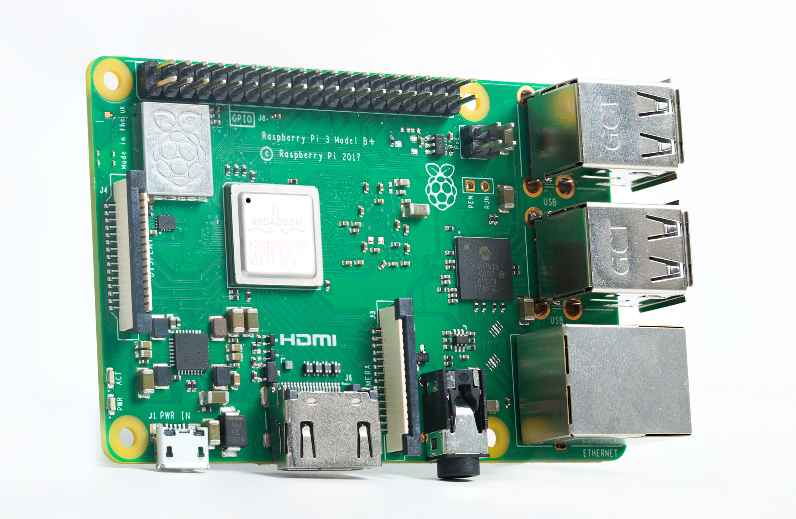
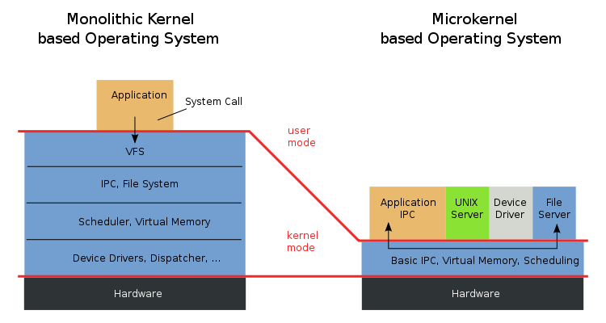
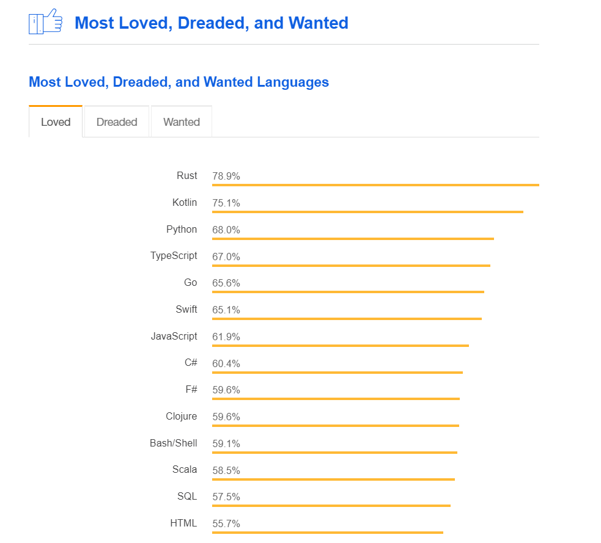
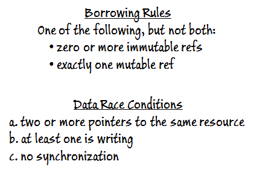
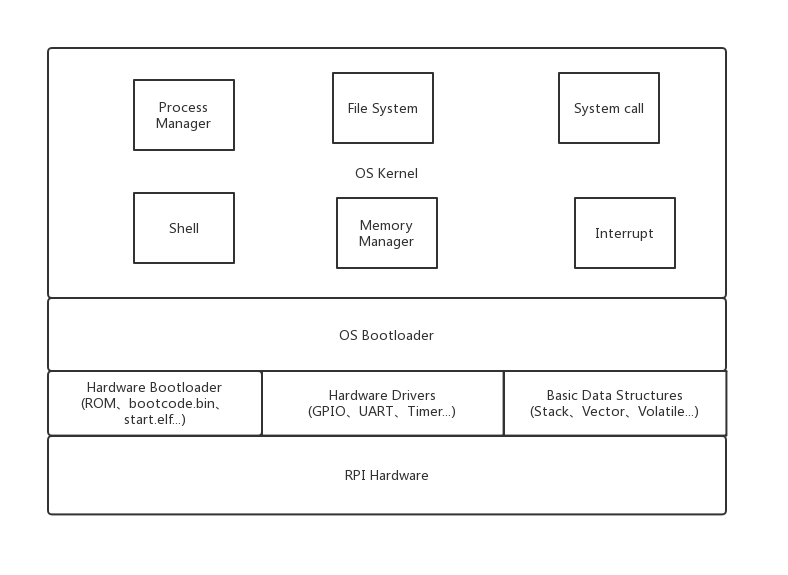

# 可行性报告

<!-- TOC -->

- [可行性报告](#可行性报告)
    - [一、项目名称](#一项目名称)
    - [二、项目简介](#二项目简介)
    - [三、理论依据](#三理论依据)
        - [1. Raspberry Pi](#1-raspberry-pi)
            - [1.1 About Raspberry Pi](#11-about-raspberry-pi)
            - [1.2 Hardware of Raspberry 3B+](#12-hardware-of-raspberry-3b)
            - [1.3 How it boots?](#13-how-it-boots)
                - [1. 第一阶段 bootloader](#1-第一阶段-bootloader)
                - [2. 第二阶段 bootloader](#2-第二阶段-bootloader)
        - [2. Operating System](#2-operating-system)
            - [2.1 About operating system](#21-about-operating-system)
            - [2.2 What features a modern OS?](#22-what-features-a-modern-os)
        - [3. Rust Programming Language](#3-rust-programming-language)
            - [3.1 About Rust](#31-about-rust)
            - [](#)
            - [3.2 Why choose Rust?](#32-why-choose-rust)
                - [3.2.1 Why not assembly language?](#321-why-not-assembly-language)
                - [3.2.2 Why not application programming  language?](#322-why-not-application-programming--language)
                - [3.2.3 Why not C or C++?](#323-why-not-c-or-c)
                - [3.2.4 Why Rust?](#324-why-rust)
    - [四、技术依据](#四技术依据)
        - [1. How Rust makes OS safe?](#1-how-rust-makes-os-safe)
            - [1.1 Enforced memory safety](#11-enforced-memory-safety)
            - [1.2 Thread and concurrency safety](#12-thread-and-concurrency-safety)
            - [1.3 Zero cost safety](#13-zero-cost-safety)
            - [1.4 `unsafe` 标签](#14-unsafe-标签)
            - [1.5 Other Redox safety features](#15-other-redox-safety-features)
            - [1.6 rust 操作系统可能的不足之处（目前）](#16-rust-操作系统可能的不足之处目前)
                - [Negative](#negative)
                    - [Linux](#linux)
                    - [Windows](#windows)
        - [2. Rust OS still fast](#2-rust-os-still-fast)
        - [Rust is feasible (Samples)](#rust-is-feasible-samples)
            - [[Redox](https://redox-os.org/)](#redoxhttpsredox-osorg)
            - [[CS140e](https://cs140e.sergio.bz)](#cs140ehttpscs140esergiobz)
    - [五、设计方案](#五设计方案)
        - [1. 总体架构图](#1-总体架构图)
        - [2. 从硬件到软件](#2-从硬件到软件)
        - [3. 基本数据结构](#3-基本数据结构)
            - [3.1 栈(Stack)](#31-栈stack)
            - [3.2 Volatile](#32-volatile)
        - [4. 内核数据结构](#4-内核数据结构)
            - [4.1 链表 (Link List)](#41-链表-link-list)
            - [4.2 队列 (Queue)](#42-队列-queue)
            - [4.3 映射 (Map)](#43-映射-map)
            - [4.4 二叉树 (Binary Tree)](#44-二叉树-binary-tree)
        - [5. 文件系统](#5-文件系统)
            - [5.1 类型选择](#51-类型选择)
            - [5.2 实现相关](#52-实现相关)
        - [6. 内存管理](#6-内存管理)
        - [7. 进程管理](#7-进程管理)
            - [7.1 进程信息维护](#71-进程信息维护)
            - [7.2 进程调度](#72-进程调度)
        - [8. 其它部分](#8-其它部分)
    - [六、参考资料](#六参考资料)

<!-- /TOC -->

## 一、项目名称

<big>**Implementing an OS on a Raspberry Pi 3 with Rust**</big>

## 二、项目简介

使用 Rust 编程语言写一个能在树莓派上运行的操作系统。

**硬件设备**

- 树莓派 3B+（OSH 课程统一发放）；
- Micro SD 卡 （OSH课程统一发放）；
- CP2102 USB to TTL 转换器；
- 读卡器。

**学习资源**

- ***OSH 课程和教材***；

- [***CS140e 课程***](<https://cs140e.sergio.bz/>)；

- [Writing an OS in Rust](https://os.phil-opp.com/second-edition/) By Philipp Oppermann；

- [Rust 官方文档](https://doc.rust-lang.org/stable/)；

- [rust-raspi3-OS-tutorials](<https://github.com/rust-embedded/rust-raspi3-OS-tutorials>) on Github.com；

- [CS140e](<https://www.reddit.com/r/cs140e/>) on Reddit.com；

  ……

**概要**

主要参考斯坦福大学 2018 年 CS140e 课程，在树莓派上完成一个操作系统的基本组成（引导、文件系统、内存系统、进程管理等），先达成能上机跑起来的目标（连接显示器，开机后能够显示一个Shell，提供对常用命令的支持）。若仍有余力，将在某些部分（如进程调度、文件系统）上做进一步优化。**本项目重点不在做出什么新东西，做出什么比 [Redox](<https://www.redox-os.org/>) 更好的东西，而是试图通过“造轮子”的过程，将 OSH 课上学的东西用起来。**

## 三、理论依据

### 1. Raspberry Pi

#### 1.1 About Raspberry Pi

树莓派（Raspberry Pi），是一款基于Linux的单片机计算机。它由英国的树莓派基金会所开发，目的是以低价硬件及自由软件促进学校的基本计算机科学教育

#### 1.2 Hardware of Raspberry 3B+

- 处理器：博通 BCM2837B0 SoC，集成四核 ARM Cortex-A53（ARMv8）64位 @ 1.4GHz CPU，集成博通 Videocore-IV GPU；
- 内存：1GB LPDDR2 SDRAM；
- 有线网络：千兆以太网（通过 USB2.0 通道，最大吞吐量 300Mbps）；
- 无线网络：2.4GHz 和 5GHz 双频 Wi-Fi，支持 802.11b/g/n/ac；
- 蓝牙：蓝牙 4.2 & 低功耗蓝牙（BLE）；
- 接口：HDMI 接口，3.5mm 模拟音频视频插孔，4 x USB 2.0 接口，RJ45 以太网口，摄像机串行接口（CSI），显示器串行接口（DSI），Micro SD 插槽，40 Pin 扩展双排插针。



#### 1.3 How it boots?

 树莓派支持 Micro SD card 启动和 USB 启动，由于我们只用到 Micro SD card 启动方式，因此接下来将只介绍它。

##### 1. 第一阶段 bootloader

树莓派上电后，GPU 核心启动，GPU 开始执行第一阶段的 bootloader (`bootloader.bin`)。bootloader 读取 SD 卡，将第二阶段的 bootloader (`start.elf`) 加载到 GPU，`start.elf`开始执行。

##### 2. 第二阶段 bootloader

`start.elf `检索附加配置文件（`config.txt`、`fixup.dat`），按照 `config.txt`来配置 ARM CPU，寻找`kernel*.img`文件，将其加载入内存，命令 CPU 开始执行`kernel*.img`中的程序。

### 2. Operating System

#### 2.1 About operating system

*An operating system (OS) is system software that manages computer hardware and software resources and provides common services for computer programs.* ([Wikipedia](https://en.wikipedia.org/wiki/Operating_system))

操作系统是一个管理硬件和软件资源、并为其它程序提供通用服务的系统软件。

#### 2.2 What features a modern OS?

- Memory Management

  动态地分配和回收内存；虚拟内存（一种能让实际使用内存容量大于物理容量的技术）……

- Program Management

  确保程序和程序间、程序和系统间的“隔离”，即程序不能破坏其它程序，更不能破坏系统；处理程序的请求（如程序申请内存和释放内存）……

- File System

  文件系统决定了数据在存储设备中怎么被存储和取得；

- Multitasking

  在多个程序间切换和分配时间帧（timeframe），并采用合适的调度策略；向用户提供任务管理器（如 Windows 下的任务管理器）；利用任务状态段（TSS，Task State Segment）实现任务切换……

- Memory Protection

  对针对内存的非法操作（如空指针操作、程序对自身的覆写等）识别和处理……

- Fixed Base Address

  固定基地址意味着程序总是用一个固定的加载入内存的地址，比如 BIOS 和 Bootloader；

- Multiuser

  用户管理和安全保护；用户间切换；是否允许多用户同时登陆……

- Kernel

  内核是操作系统最核心的部分，根据不同系统内核策略不同，内核所包括的部分不一（Microkernel 和 Monolithic Kernel）；

  

- Shell

  Shell 俗称“壳”，是指“为使用者提供操作界面”的软件，一般包括 Command Shell 和 Graphical Shell；

- Graphical User Interface (GUI)

  为用户提供友好的图形化界面，严格来说 GUI 在操作系统中并不重要，但是一般提到操作系统，人们大多会想到图形界面；

- Bootloader

  Bootloader 被 BIOS 加载，用来加载并运行内核。树莓派中的启动和普通电脑有些不同，前文已做叙述；

  ……

### 3. Rust Programming Language

#### 3.1 About Rust

Rust 是一个着重于安全性（特别是并发安全）的多重范型编程语言。Rust 在语法上和 C++ 类似，但是能够在保持高性能的同时提供更好的内存安全性。

<p align="center">

</p>

Rust 由 Mozila Research 的 Graydon Hoare 设计，Dave Herman、Brendan Eich 亦有贡献。

Rust 在 Stack Overflow 的 [2016](https://stackoverflow.com/insights/survey/2016#technology-most-loved-dreaded-and-wanted)、[2017](https://stackoverflow.com/insights/survey/2017#most-loved-dreaded-and-wanted)、[2018](https://insights.stackoverflow.com/survey/2018/#most-loved-dreaded-and-wanted) 年开发者调查中，是“最被喜爱的编程语言”。



#### 

Rust 是系统编程语言，专门用来编写以往由 C 或 C++ 编写的高性能程序，但是 C 和 C++ 非常容易出现一系列类似无效内存访问（segmentation faults）的问题，Rust 的出现就是为了避免类似问题的发生。 Rust 的一些重要特性如下。

- 模式匹配和代数型的数据类型（枚举）；
- 基于任务的并发性。轻量级的任务都可以在不共享内存的情况下并发运行；
- 高阶函数（闭包）；
- 多态性，结合类似 Java 的接口特性和 Haskell 的类类型；
- 泛型；
- 没有缓冲区溢出；
- 默认情况下不可变；
- 非阻塞的垃圾收集器。

#### 3.2 Why choose Rust?

##### 3.2.1 Why not assembly language?

早期的操作系统是用汇编语言编写的，但是后来的操作系统，几乎很少有完全用汇编语言编写的，完全用汇编语言而且还用户友好（主要指有图形界面）的更是少之又少（如 [KolibriOS](http://kolibrios.org/en/index), [MenuetOS](http://www.menuetos.net/download.htm)），为什么开发者大多不选择汇编语言作为 OS 的开发语言呢，主要有两点原因：

1. 工作量大。汇编语言可以看成是机器语言的助记表示，某种意义上写汇编和直接写机器代码没有本质区别，只不过前者更便于使用而已。汇编语言对寄存器和存储器的直接操控，使得其执行效率相比高级语言更高（这里的执行效率是指完成同样的功能所需要的底层操作的次数）。但是显然，汇编语言需要程序员去完成怎么存数据、怎么取数据、数据直接怎么计算等等操作，使得程序复杂度大大提高，可读性大大降低；
2. 不可移植。汇编有“机器相关性”，这个特性一方面使得汇编语言能够针对特定机器写出特定的程序，更好地发挥机器的性能；但是另一方面也使得汇编程序的可移植性大大降低。

基于这些原因，现代操作系统一般只在最底层部分（如内核和设备驱动程序）使用少量汇编语言，作为对 C 语言的补充，非底层部分则可以使用 C、C++、Java、Go 等语言开发。

##### 3.2.2 Why not application programming  language?

从理论上来讲，任何编程语言都可以用来写操作系统——甚至脚本语言也可以通过先生成机器码的引导程序来加载自己的解释器，然后执行脚本，如基于 Python 的操作系统 [pythonix](<https://github.com/wfxpanisa/pythonix>)，但是可以做并不意味着就适合做。

内核和设备驱动是操作系统的核心部分，而这两部分都需要和直接和硬件打交道，很多应用编程语言为了降低复杂度、提高安全性，选择隐藏底层细节，将硬件细节抽象化。这样在提高编程效率的同时，也决定了无法直接接触到底层硬件、无法对硬件高效管理，使得操作系统的运行效率不高。

##### 3.2.3 Why not C or C++?

C 和 C++ 既作为高级语言能够很容易被人理解，又能提供足够的底层支持。支持对内存的直接访问，支持指针操作，没有运行时（runtime）开销，支持 ***Assemby code inline***（可以简单理解成支持在高级语言程序里面插入汇编代码）…… 因为种种优秀的特性，C 和 C++ 在操作系统领域被大量使用，如 Windows 的内核主要由 C 编写，其它部分主要由 C 和 C++ 编写；Mac 的内核主要使用 C 编写；Linux 大部分都是由 C 编写。 但是 C 和 C++ 写的程序也往往有一些很严重的问题，如空指针、野指针、数据竞争等等，在日益追求安全性的今天，C 和 C++ 的安全性问题成为了巨大的隐患。

##### 3.2.4 Why Rust?

> Rust is a ***system*** programming language.

和应用编程语言（application programming  language）不同，系统编程语言（system programming language）大多具有如下特性：

1. 效率高，运行时（runtime）开销小；
2. 具有很小的运行库，或者没有；
3. 允许直接且“原始”地控制内存访问、控制流；
4. 允许直接以汇编语言编写部分程序。

过去的几十年，系统编程几乎一直都是 C 和 C++ 程序员的地盘，Rust 语言自 2015 年发布后，成为了一款对标 C++ 的系统编程语言。

Rust 既有 C 和 C++ 的速度和对底层的支持性，又有 ownship、lifetime、强类型、静态类型等安全特性（参见本报告下一部分），使得其成为了当前最适合接替 C 和 C++ 来写操作系统的语言。

## 四、技术依据

### 1. How Rust makes OS safe?

上节已经讨论了 rust 的一些安全特性，本节会介绍 rust 的这些特征如何在 OS 中体现出来。

#### 1.1 Enforced memory safety

先看一个 C 语言常见的 bug ：

```c
int *func (void)
{
    int num = 1234;
    int *p = &num;
    return p;
}

p = func()
```

这就是 C 语言悬空指针的问题。在调用 func 之后一段时间，尝试从该指针中读取 num 的值，可能仍然能够返回正确的值 (1234)，但是任何接下来的函数调用会覆盖原来的栈为 num 分配的空间。这时候对指针 `p` 进行读，就有可能获得这个程序本来没有权限获得的数据；改写 `p` 指针的内存则可能带来更灾难的后果，甚至使得系统崩溃。

rust 是这么做的：

```rust
fn main() {
    let reference_to_nothing = dangle();
}

fn dangle() -> &String {
    let s = String::from("hello");

    &s
}
```

我们试图使 `s` 悬空，但编译器会报错：

> this function's return type contains a borrowed value, but there is no value for it to be borrowed from.

此时指针的值 invalid, 编译器会阻止我们返回这个值。

然而这种 bug 非常基础，普通的 C 编译器也能发现。但在程序越来越复杂之后，悬空的指针可能隔了很多个函数才被调用，C 编译器就不够聪明了，但 rust 还是能在编译时发现这种问题。这正是 Ownership 的威力。

一个更有说服力的例子是数据读写的竞争冒险问题。操作系统课告诉我们，一个时候可以有很多个读者，或者只有一个写者，系统才能正常运行。以下是发生竞争冒险问题的条件：

- two or more pointers to the same resource
- at least one is writing
- the operations are not synchronized

而 rust 里的指针（称之为 reference），分为可变和不可变两种。不可变的指针只能读所指向的值，而可变指针可以写。在 rust 指针的数据结构层面，有如下规定：

1. the borrower’s scope must not outlast the owner
2. you can have one of the following, but not both:
    1. zero or more references to a resource; or
    2. exactly one mutable reference

如果不满足这些要求，编译器不会放行。规则 1 在我们的第一个例子里体现，而规则二则保证了竞争冒险问题永远不会发生，因为访问这些数据的指针的行为、数量被编译器限制了。



这些例子都只是 Ownership 的一部分。而在一个用 rust 写成的 OS 里，无处不受 Ownership 的约束。这正是其安全性的强大保证。

#### 1.2 Thread and concurrency safety

事实上，rust 的特性天然的解决并发的问题，而这也是 rust 语言项目的初衷之一。许多语言都支持线程有关的库，相关的 API ，rust 也是。但 rust 能更好的解决如下问题：

- Race conditions, where threads are accessing data or resources in an inconsistent order
- Deadlocks, where two threads are waiting for each other to finish using a resource the other thread has, preventing both threads from continuing
- Bugs that happen only in certain situations and are hard to reproduce and fix reliably

一个例子：

```rust
fn foo() {
    let mut ptr = Box:new(42);      // Allocate a pointer
    thread::spawn(|| {              // Spawn a thread
        *ptr = 0;                   // Modify the pointer
    });
}
```

```rust
fn foo() {
    let mut ptr = Box:new(42);      // Allocate a pointer
    thread::spawn(move || {         // Spawn a thread
        *ptr = 0;                   // Modify the pointer
    });
}
```
前一段代码会报错，而后一段不会。关于 ptr 所有权属于哪个指针的问题，后一段代码转移了 ptr 的所有权。

#### 1.3 Zero cost safety
零开销安全性也是 rust OS 非常重要的特点。这个特点的具体含义是，大部分确保安全的工作都在编译时完成，而不是在运行时再通过各种手段来提高安全性。上文的两个例子还会再次出现，它们也都是零开销安全性的绝佳体现。

- GC
垃圾回收是避免上文所提例 1 的一个不错的方法，但并不是一个最优方案。比如，GC 机制是在运行时进行的，肯定会影响运行效率。而且就 JAVA 为例，如果我们不用去理解 GC 机制的原理，因为如果不了解其原理，可能会引发内存泄漏、频繁 GC 导致应用卡顿,甚至出现 OOM 等问题。而 rust 编译器与 Ownership 保证了指针不会悬空，可谓从源头上断绝了垃圾的产生。

- data race
在其他操作系统中，有其他的手段来避免这个问题，比如信号量或管程。但和上例相似，都在运行时进行的。

zero cost safety 有很多优点，安全性、可靠性得到了很大提升，也提高了运行速度。

#### 1.4 `unsafe` 标签

rust 语句块可以加上 `unsafe` 标签。这句咒语就是告诉编译器：“相信我，一切都天衣无缝。”编译器会允许你做如下事情：
- Dereference a raw pointer
- Call an unsafe function or method
- Access or modify a mutable static variable
- Implement an unsafe trait

事实上完全 OS 中完全避免 `unsafe` 是不可能的。和底层硬件打交道， `unsafe` 行为有时候无法避免。
> A quick grep gives us some stats: the kernel has about 70 invocations of `unsafe` in about 4500 lines of code overall.

但这种机制还是给了我们很大便利。
- 程序员还是获得了一定程度上的控制权。没有这个标签，有时候会约束程序，使得程序员无法完成所需要的功能。
- 几乎整个 OS 都是安全的，bug 调试可以集中在 `unsafe` 的地方。
- 几乎整个 OS 都是安全的，这样可以在其基础上开发一些原来没有的模块、软件或功能，安全性反哺操作系统功能。
- 给了对操作系统了解不多，或者说对系统了解不多的程序员便捷开发一个新系统的机会。

#### 1.5 Other Redox safety features

#### 1.6 rust 操作系统可能的不足之处（目前）

##### Negative

###### Linux

###### Windows

### 2. Rust OS still fast

### Rust is feasible (Samples)
#### [Redox](https://redox-os.org/)
Redox 是一个使用 rust 编写的通用的类 Unix 操作系统。它的内核结构为微内核，内核的代码量约为 16000 行。Redox 不仅仅是个内核，而是个全功能的操作系统，它提供了内存分配器、文件系统、显示管理器等扩展，和内核本身共同构成了一个实用、便捷的操作系统生态。某种意义上可以把它理解成基于内存安全的编程语言的、加上一些现代技术的 GNU 或 BSD 生态。

#### [CS140e](https://cs140e.sergio.bz)
斯坦福在 2018 年冬季学期开设的 CS140e 是一个实验课，在课中学生们使用 rust 开发一个可以在树莓派 3 上运行的操作系统。课上的四个 assignments 依次为：
1. shell 和 bootloader；
2. SD 卡驱动和 FAT32 文件系统；
3. spawn, 在不同的进程中加载并执行位于 SD 卡上的程序；
4. multicore multitasking.

第四个 assignment 最后没有布置。另外还有一个 assignment 是搭建一个完整的操作系统。

由于大作业主要参考 2018 年的 CS140e，故参考该课程对工作量做一个估计。CS140e 的上课时间为两个月，根据 [这里](https://cs140e.sergio.bz/assignments/info/#work-load) 所说的，单人完成每周花费的时间为 10 -- 15 小时。在代码量方面，以 [jiegec/cs140e](https://github.com/jiegec/cs140e) 为参考，需要自己写的代码行数小于 6000 行。虽然实验课最终没有将所有的实验都布置完，但是这些任务由四个人共同承担，是可行的。


## 五、设计方案

本项目的目的是针对树莓派3B+嵌入式设备，采用Rust语言(结合一定量的ARM汇编语言)开发一个可运行的，基本功能齐全的定制OS。

我们在实现过程中会参考Stanford CS140e课程及其他操作系统开发资料，并在其上做出一定程度的调整和优化工作。

以下给出初步的简要设计方案，最终的实现方案可能会在开发过程中略有改变，将在以后的报告中进行说明。

### 1. 总体架构图



### 2. 从硬件到软件

树莓派上电以后会经历数阶段的boot过程，最终跳转到kernel开头的映像文件进行执行。我们首先需要使用ARM汇编语言实现一些标准的树莓派硬件驱动(GPIO、UART、SD卡等)以方便更高层次上的使用，如控制LED闪烁、串口数据收发、显示屏交互等基本操作。

具体实现参考CS140e课程实验内容。

### 3. 基本数据结构

虽然Rust中定义了不少实用的数据类型，如```Vector```、```String```等结构，但是许多这样的结构都需要依赖操作系统提供的```malloc()```系统调用实现。考虑到现在的程序需要直接在 Raspberry Pi 裸机上运行，无法使用这些结构，我们必须直接基于硬件的空间来实现一些基本的数据结构以便在更高层次上实现内核所需的数据结构。以下介绍首要的两种结构。

#### 3.1 栈(Stack)

栈在计算机科学中可以说是最重要的数据结构之一，在最基本的层面就有栈的存在，故把栈的实现放在此处。

栈支持的最主要操作是入栈```push```、出栈```pop```和查看栈顶元素```top```，即使从汇编的角度来看也相对易于实现。

#### 3.2 Volatile

在 Rust 中有类似C语言中volatile关键字的用法，使编译器不对内存读写进行优化，直接在指定的内存地址读取或写入数据。

对于内存映射寄存器、内存映射 I/O 等，不仅用户编写的程序需要对其进行读写，硬件状态等各种外部因素，也会影响其中的值。所以需要保证每次读取的数据都为最新值，每次写入都能正确、及时进行。在这种情况下，使用 volatile 就比较有意义了。

在我们的实现中，将针对一些基本数据类型进行Volatile改进。

### 4. 内核数据结构

在内核中应当实现一些标准内建的通用数据结构、这会为后续的内核开发带来极大的方便。在上学期的课程中我们已经初步掌握了数据结构的原理、实现与使用，而内核开发中最常用的有以下几种。

#### 4.1 链表 (Link List)

最简单、最普通的数据结构，但相当有用。它是一种存放和操作可变数量元素(结点)的数据结构，其所包含的元素都是动态创建并插入的。由于链表中各个元素的创建时间一般各不相同，所以它们在内存中无需占用连续的内存区，也就是说，通过指针操作即可简单地实现链表。

除了创建```init```、清空```clear```、销毁```destroy```等基本操作，链表的特征操作有插入元素```insert```、删除元素```delete```、查找元素```search```、遍历```traverse```等。而随着用途的不同，它也会要求实现一些其它的操作，如移动```move```或合并```merge```结点。

在操作系统内核的开发中，链表可以用于一系列动态数据的管理。比如存储管理中可分配存储的链表、进程管理中用于表示进程状态的PCB连接的链表等。

#### 4.2 队列 (Queue)

对任何操作系统内核来说，生产者和消费者的编程模型是必不可少的。在该模式中，生产者创造数据(错误信息、数据包)而消费者读取这些信息和数据并以某种方式来消费这些数据，一般来说消费者获取数据的顺序和加入队列的顺序是一致的，也就是遵守FIFO规则。队列是实现这种FIFO模型的最简单的方式。其可以简单地基于数组或链表来实现。

队列至少需要支持入队```enqueue```、出队```dequeue```的基本特殊操作。

在操作系统内核的开发中，队列适合一切基于FIFO规则的模型。比如进程管理中的多级队列调度算法中的任务队列、进程通信中的消息队列等。

#### 4.3 映射 (Map)

映射，又名关联数组，是由唯一键组成的集合，维护一组键值对(Key-value pair)。使用散列表(Hash table)可以实现之，我们的实现中主要利用它。

映射至少要支持添加键值对```add```、删除键值对```remove```和根据键查找对应值```value```的操作。

在操作系统内核的开发中，映射通常用于实现映射关系。比如文件系统中的Hash文件、内存分配的Hash算法等。

#### 4.4 二叉树 (Binary Tree)

按照所需的用途更具体地说应该是二叉平衡搜索树(Balanced BST)或者是其中的一种实现——红黑树，我们需要这样一种数据结构来对需要迅速检索的大量数据来进行维护。其实现相比上述三种来说要复杂，此处不予赘述。

红黑树需要支持的操作同链表与映射类似，不过其性能优于链表，能够保证搜索的时间复杂度为对数关系，按序遍历为线性关系。

在操作系统内核的开发中，树常用于大量数据的管理或树形结构的表示。比如文件系统中的目录树等。


### 5. 文件系统

文件系统提供了在线存储和访问计算机操作系统和所有用户的程序与数据的机制。其由两个不同的部分组成：一组文件(用于存储相关数据)和目录结构(用于组织系统内的文件并提供有关文件的信息)。而对于我们的实现方案来说，需要考虑以下一些问题。

#### 5.1 类型选择

处于兼容性与简单的考虑，我们决定重新实现一个FAT32文件系统。开发过程中必须严格按照其标准来实现。

#### 5.2 实现相关

本项目中使用的SD卡存储设备采用MBR(Master Boot Record)分区表，故我们可以基于它来获取分区信息并实现文件系统。

MBR 位于磁盘的前 512 个字节，能够保存四条分区记录，对应四个分区。每条分区记录中，保存有分区的类型(0xb 或 0xc 代表 FAT32)，以及起始位置和大小。MBR 的最后两个字节为 0x55, 0xaa，用于检查磁盘是否使用了 MBR。而EBPB (Extended Bios Parameter Block) 位于每个分区起始位置，包含关于磁盘和分区的重要信息。读取方式与 MBR 基本相同。在实际实现的代码中，需要读取 MBR 后，填充到结构体，并检查其中内容无误。

而在具体实现FAT32文件系统时，也需要对该文件系统的详细信息进行研究，可以参照FAT32的白皮书。

### 6. 内存管理

我们的项目将运行在树莓派裸金属上，不需要考虑虚拟地址空间的设计。

在ARM CPU 中，有部分内存地址区域中，保存有关于该 CPU 的一些信息，例如内存大小等。这些信息以类似TLV的形式进行保存，可通过程序进行遍历，获取必要的信息。

而为了让我们的OS可以合理地管理内存，就需要实现存储控制方面的函数，比如可以通过读取 ATAGS，获取内存的大小和起始位置，并返回可用内存地址范围。

我们实现的操作系统会将可用内存范围组织成链表，基于此来进行内存分配、释放和碎片整理等操作。

在实现的过程中，我们会参考常见的内存管理方法，并利用Rust的特性来增加管理的安全性。

### 7. 进程管理

进程管理是操作系统中一个非常重要的概念。在这一部分中，我们将考虑进程的资源分配、信息维护以及调度方案。

#### 7.1 进程信息维护

在进程的控制中，必须维护一些关于进程的信息，在我们的实现中，采用标准的进程控制块(PCB)链表结构。

对于内核，在PCB中需要为每个进程维护如下信息：

- 栈
- 堆
- 父进程
- 可执行代码
- 调度器状态（进程是否需要被得到调度）
- 运行状态（寄存器等信息，方便上下文切换后进行恢复）

#### 7.2 进程调度

事实上，线程是进程调度的最小单位。此处暂时不做区别，一概以进程相称。

常用的进程调度策略有以下一些，出于性能考虑，我们希望以抢占式算法(RR、MFQS)为主要算法，多种调度算法相结合的设计策略。

- 先到先服务策略(FCFS)：最简单的CPU调度策略，可以直接用一个队列简单实现，不过问题也层出不穷，如考虑I/O时CPU与设备利用率相对较低。
- 最短作业优先调度策略(SJF)：理论上的优秀算法，但在实际实现中，由于无法知道下一个CPU区间的长度，故不能在短期CPU调度层次上加以实现。
- 优先级调度策略(PS)：每个进程都有一个关联的优先级，高优先级优先。虽然比较灵活但仍存在饥饿的主要问题。
- 轮转法调度策略(RR)：专为分时系统设计，类似FCFS，但增加了抢占以切换进程，是公平的调度策略。
- 多级反馈队列调度策略(MFQS)：较为成熟的调度策略，可以对其中不同的队列按照情况使用不同的调度算法，并可以控制进程在队列中的进出。

我们在初步的的实现中希望采取轮转法作为主要策略，有余裕则尝试实现MFQS策略。

### 8. 其它部分

一个操作系统中所包含的要素当然不仅仅包括这些，还有很重要的异常与中断处理、内核同步和由此带来的时间管理部分等。这暂时需要进一步的学习。

除此之外，我们还希望用户可以通过Shell对该操作系统进行管理，这也要求我们在操作系统的系统调用基础上实现一些命令行操作，如类似Linux操作系统的```time```、```ls```、```mkdir```、```top```等。这些我们会用于操作系统实现过程中的调试，所以Shell和命令行操作的实现会跟着内核的实现逐步进行。

虽然我们的目标是实现一个简单的操作系统，但如果有足够的时间就会考虑对其性能进行优化。


## 六、参考资料

- [BrokenThorn Entertainment](http://www.brokenthorn.com/Resources/OSDevIndex.html)

- [Stanford CS140e - Operating Systems](https://cs140e.sergio.bz/)

- [Rust Documentation](https://doc.rust-lang.org/stable/)

- [Writing an OS in Rust](https://os.phil-opp.com/)

- [rust-embedded/rust-raspi3-OS-tutorials: Rust bare-metal and OS tutorials on the Raspberry Pi 3](https://github.com/rust-embedded/rust-raspi3-OS-tutorials)

<<<<<<< HEAD
- [Stanford: An experimental course on operating systems](https://www.reddit.com/r/cs140e/)
=======
1. [BrokenThorn Entertainment](http://www.brokenthorn.com/Resources/OSDevIndex.html)
2. [Redox Book](https://doc.redox-os.org/book/)
>>>>>>> 60ad1398811a3987338fd20bd56c270dc2f66d82
