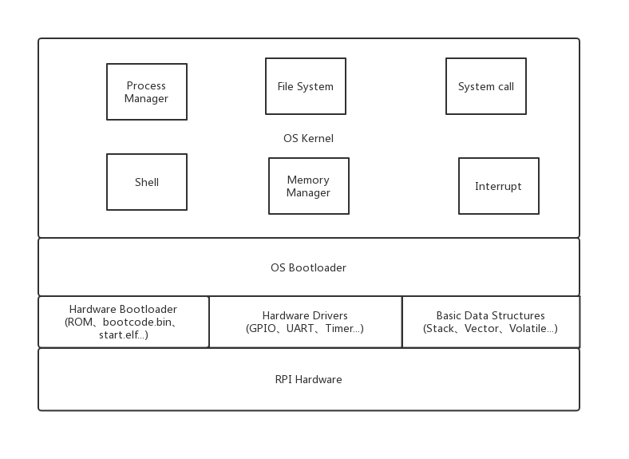

# 可行性报告

[TOC]

## 项目名称

<big>**Implementing an OS on a Raspberry Pi 3 with Rust**</big>

## 项目简介

（based on Research.md)

## 理论依据 (YL)

### Why Rust is safe?

(Rust 语言特性 ownership、option<>、)

###

## 技术依据 (LWS WRC)

### How Rust make OS safe? 

(OS里面如何用rust内禀的一些特性)

#### Samples

##### Postive

###### Redox

###### bkernel

##### Negative

###### Linux

###### Windows

### Rust is feasible (Samples) 

##### Redox

##### bkernel

##### CS140e

## 设计方案 (LYF)

本项目的目的是针对树莓派3B+嵌入式设备，采用Rust语言(结合一定量的ARM汇编语言)开发一个可运行的，基本功能齐全的定制OS。

我们在实现过程中会参考Stanford CS140e课程及其他操作系统开发资料，并在其上做出一定程度的调整和优化工作。

以下给出初步的设计方案，最终的实现方案可能会在开发过程中略有改变，将在以后的报告中进行说明。

### 总体架构

#### 从硬件到软件

#### 基本数据结构

虽然Rust中定义了不少实用的数据类型，如

#### 文件系统

##### 类型选择

兼容性、实用性 => FAT32(自己从头实现！)

#### 内存管理

#### 进程管理

##### 进程信息维护

##### 内核态与用户态

##### 进程调度

#### 系统调用的设计
