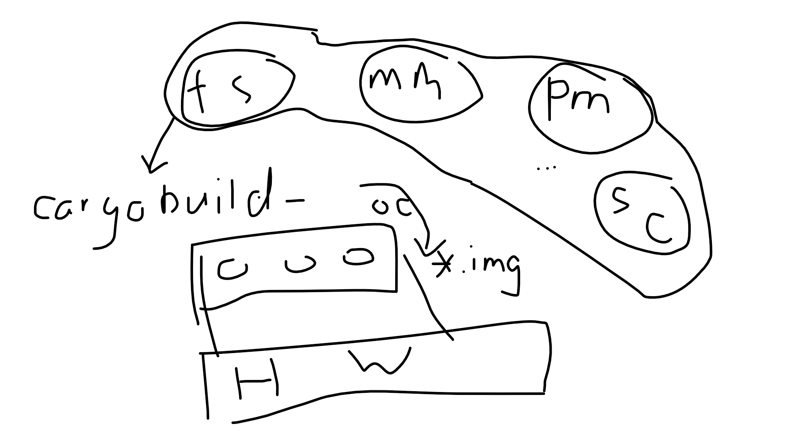

# 可行性报告

[TOC]

## 项目名称

<big>**Implementing an OS on a Raspberry Pi 3 with Rust**</big>

## 项目简介

（based on Research.md)

## 理论依据 (YL)

### Why Rust is safe?

(Rust 语言特性 ownership、option<>、)

###

## 技术依据 (LWS WRC)

### How Rust make OS safe? 

(OS里面如何用rust内禀的一些特性)

#### Samples

##### Postive

###### Redox

###### bkernel

##### Negative

###### Linux

###### Windows

### Rust is feasible (Samples) 

##### Redox

##### bkernel

##### CS140e

## 设计方案 (LYF)

### 总体架构图

#### FS

#### MM

#### PM

...