# 结题报告


## 项目名称

<big>**Implementing an OS for Raspberry Pi 3 in Rust**</big>

## 项目介绍

使用 Rust 编程语言写一个能在树莓派上运行的操作系统。

**硬件设备**

- 树莓派 3B+（OSH 课程统一发放）；
- Micro SD 卡 （OSH课程统一发放）；
- CP2102 USB to TTL 转换器；
- 读卡器。

**学习资源**

- ***OSH 课程和教材***；

- [***CS140e 课程***](<https://cs140e.sergio.bz/>)；

- [Writing an OS in Rust](https://os.phil-opp.com/second-edition/) By Philipp Oppermann；

- [Rust 官方文档](https://doc.rust-lang.org/stable/)；

- [rust-raspi3-OS-tutorials](<https://github.com/rust-embedded/rust-raspi3-OS-tutorials>) on Github.com；

- [CS140e](<https://www.reddit.com/r/cs140e/>) on Reddit.com；

  ……

**概要**

主要参考斯坦福大学 2018 年 CS140e 课程，在树莓派上完成一个操作系统的基本组成（引导、文件系统、内存系统、进程管理等），先达成能上机跑起来的目标（连接显示器，开机后能够显示一个Shell，提供对常用命令的支持）。若仍有余力，将在某些部分（如进程调度、文件系统）上做进一步优化。**本项目重点不在做出什么新东西，做出什么比 [Redox](<https://www.redox-os.org/>) 更好的东西，而是试图通过“造轮子”的过程，将 OSH 课上学的东西用起来。**


## 立项依据

为节省篇幅，此处不再重复，详见[可行性报告](feasibility.md)。

## 项目架构

### 整体架构


### 工作原理

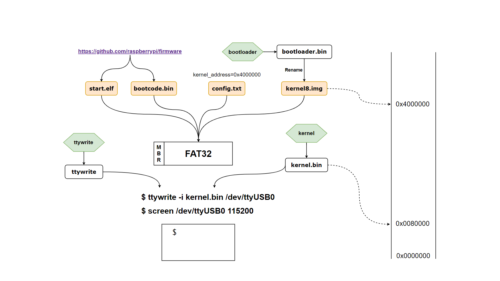

上图中，绿色背景的六边形表示 Rust 项目，橙色背景的圆角矩形表示树莓派启动必须的 4 个文件。

本项目中，树莓派启动必需文件有 4 个：`start.elf`, `bootcode.bin`, `config.txt`,  `kernel8.img`。`start.elf`和`bootcode.bin`文件从 https://github.com/raspberrypi/firmware/tree/master/boot 下载，这两个文件分别负责树莓派启动的第一和第二阶段，简单来讲`bootcode.bin`首先运行，它又启动`start.elf`，`start.elf`按照`config.txt`里的信息来配置 CPU（如没有就按默认配置来配置），本项目中，`config.txt`的内容是：

```
kernel_address=0x4000000
device_tree=
```

其中最关键的一行是`kernel_address=0x4000000`，表示`start.elf`应该将`kernel8.img`加载到内存地址`0x4000000`处（`kernel8.img`的来源是`bootloader.bin`）。

将这四个文件放入 MBR 分区表下的一个 FAT32 分区中， 将树莓派利用 USB to TTL 转接线连接到电脑，`kernel8.img`开始工作，它的作用是按照 XMODEM 通信协议一直等待接收信息，且在接收完成后，将 PC 跳转到地址`0x0080000`处。

我们对系统源码做了修改后，编译生成新的`kernel.bin`文件，再利用`ttywrite`工具，将刚生成的`kernel.bin`文件遵循 XMODEM 协议发送到串口设备中（图中是 ttyUSB0），对应命令是`ttywrite -i kernel.bin /dev/ttyUSB0`。

树莓派中正在运行着的`kernel8.img`负责按照 XMODEM 协议接收文件，并把文件加载到内存地址`0x0080000`处，传输完成后，PC 跳到`0x0080000`，新传入的`kernel.bin`得以被加载，Shell 程序开始运行。

最后，再使用`screen`命令来和串口设备通信：`screen /dev/ttyUSB0 115200`，如下图所示：

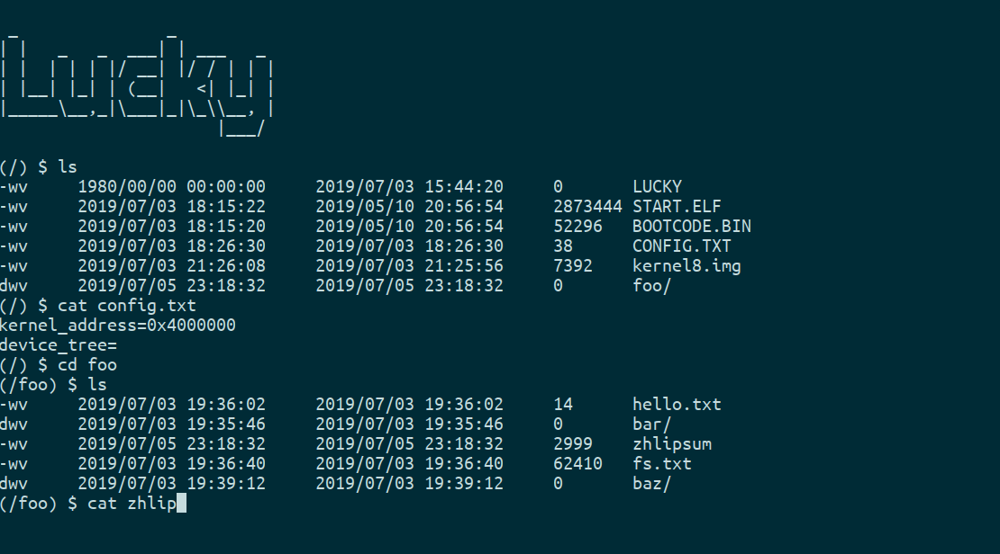

使用这种树莓派中运行接受文件、接受完成后调整 PC 到新接受的系统镜像的方式，避免了每次修改完系统编译成新的镜像后都要重新插拔 Micro SD 卡的麻烦。

### Hardware

# Chapter 1 硬件与准备工作

### 一、准备工作

#### 1. Volatile存储访问（```os/volatile/src/```）

在我们的项目中，会有很多对于硬件层面存储的修改（寄存器层次），而在这种层次上的直接修改有两方面需要考虑的问题：

1. 安全性问题

   对存储内容的读写涉及到许多操作系统安全性的问题，尤其是对于硬件。所以这方面需要提供一个良定义的抽象结构。

2. 编译器优化问题

   考虑下面的代码示例：

   ```rust
   fn f() {
       let mut x = 0;
       let y = &mut x;
       *y = 10;
   }
   ```

   编译器的“优化”可能直接删除最后一句对```*y```的赋值，因为之后没有对其的访问。出于相同的原因，编译器也有可能将对```x```、```y```甚至```f()```的声明给完全删除掉。

   一般来说，这有助于加速程序而不影响输出，但对于硬件方面它可能带来一些出乎意料的结果。如果```y```指向一个只写的内存映射寄存器，那么最后的赋值语句仍可能在不去读取```y```的情况下产生一些效应。这种时候我们不希望编译器优化这种访存语句。

   

对于上述问题的解决依赖于对```Volatile```内存访问的实现，这种类型为我们提供了安全访问的接口并避免了编译器的错误优化。

我们提供了三种```Volatile```数据类型和一个```Reserved```类型作为封装，兼顾了只读、只写和读写和保留的情形。

```rust
//给只读类型的封装，实现read方法
pub struct ReadVolatile<T>(T);
//给只写类型的封装，实现write方法
pub struct WriteVolatile<T>(T);
//兼顾只读和只写的封装，实现read与write方法
pub struct Volatile<T>(T);
//保留类型封装，项目中对这些封装不予读写
pub struct Reserved<T>(T);
```


#### 2. XMODEM协议（```1-shell/xmodem/src/```）

XMODEM是在1978年由Ward Christensen创建的用于调制解调器纠错的协议，使用奇偶校验作为查错控制的方法。在我们的项目中采用该协议来向树莓派传输文件。为此，我们需要使用rust来实现该协议的接收端。

XMODEM是一种二进制、半双工的协议，它直接传输与接收字节，而且在任何时刻，支持传输者或接收者发送消息但不能同时传输。另外，它是基于数据包传输的协议：数据被分割成128字节大小的数据包。

在传输的某些时机中，有一些特殊字节作为信号字节存在，定义如下：

```rust
const SOH: u8 = 0x01;		//
const EOT: u8 = 0x04;       //end of transfer
const ACK: u8 = 0x06;       //positive acknowledgement
const NAK: u8 = 0x15;       //negative acknowledgement
const CAN: u8 = 0x18;       //cancel
```

一次完整的传输过程与描述如下：


为了传输一个数据包，传送方需要：

1. 发送一个```SOH```字节
2. 发送数据包编号
3. 发送数据包编号的补码形式
4. 发送包体
5. 发送数据包校验和
6. 读取来自接收方的字节：
   - 若为```NAK```（未接收成功），则重试上述流程直到10次为止
   - 若为```ACK```（接收成功），则发送下一个包体

要接受一个数据包，接受方需要：

1. 等待发送方的```SOH```或```EOT```字节
   - 收到其它字节时取消传输
   - 收到```EOT```字节（传输完毕）,则完成传输
2. 读取下一个字节并与当前数据包编号比较，若不同则取消传输
3. 读取下一个字节并与当前数据包编号的补码比较，若不同则取消传输
4. 读取128字节大小的数据包
5. 计算数据包的校验和
6. 读取下一个字节并与计算得到的校验和进行比较
   - 若不同，则发送```NAK```字节请求重新传输
   - 否则发送```ACK```表明完毕，准备接收下一个包体

在传输过程中，双方均可以发送```CAN```字节直接退出传输过程

而当所有的数据包传送完毕时，进入传输终止阶段，此时传送方（接受方）：

1. 发送一个```EOT```字节
2. 等待```NAK```（发送```NAK```），不同则错误退出
3. 发送第二个```EOT```
4. 等待```ACK```（发送```ACK```），不同则错误退出


在我们的项目中，XODEM描述如下：

```rust
pub struct Xmodem<R> {
    packet: u8,
    inner: R,
    started: bool,
    progress: ProgressFn
}

```

为其实现的一系列接口如下，是对上述具体过程的实现：

```rust
//使用XMODEM协议对数据进行发送，若数据大小不是128字节的倍数，则补零后进行发送
pub fn transmit_with_progress<R, W>(mut data: R, to: W, f: ProgressFn) -> io::Result<usize>
    where W: io::Read + io::Write, R: io::Read{}
//使用XMODEM协议对数据进行接收，返回应为128的倍数的数据大小
pub fn receive_with_progress<R, W>(from: R, mut into: W, f: ProgressFn) -> io::Result<usize>
	where R: io::Read + io::Write, W: io::Write{}

```

该协议使用于```ttywrite```部分。

#### 3. 使用TTYwrite实现设备交互（```1-shell/ttywrite/src/```）

为了从编译源码的机器上将编译后的内核等其它数据依照XMODEM协议传输到树莓派机器中，我们借助了命令行应用```ttywrite```。

```ttywrite```命令可以根据波特率、字大小等设置对指定文件进行串行传输。其具体用法在工作原理中已进行说明。

### 二、树莓派BCM2837设备驱动（```os/pi/```）

为了使操作系统内核可以跟树莓派底层硬件交互，使操作系统功能的实现和调试成为可能，我们必须根据树莓派本身的硬件配置实现一系列设备驱动。

根据项目的需求，要考虑的外围设备有：

- 系统计时器
- GPIO引脚
- URAT串口
- 中断控制

在实现的过程中我们仔细参考了 [BCM2837 ARM Peripherals Manual](https://cs140e.sergio.bz/docs/BCM2837-ARM-Peripherals.pdf)

#### 1. 系统计时器（```timer.rs```）

实现ARM system timer设备驱动主要具有以下作用

- 获取系统当前时间，完成定时之类的任务，方便异步信息传输。
- 产生计时中断，生成时间片进而控制进程调度。

我们所实现的简易计时器驱动只考虑相关的几个寄存器：

```rust
pub const IO_BASE: usize = 0x3F000000;
const TIMER_REG_BASE: usize = IO_BASE + 0x3000;
//Timer相关寄存器
struct Registers {
    CS: Volatile<u32>,
    CLO: ReadVolatile<u32>,
    CHI: ReadVolatile<u32>,
    COMPARE: [Volatile<u32>; 4]
}
//The Raspberry Pi ARM system timer.
pub struct Timer {
    registers: &'static mut Registers
}
```

其中用到的寄存器作用如下：

| 寄存器名称 | 描述                      |
| ---------- | ------------------------- |
| CS         | 系统计时器控制/状态寄存器 |
| CLO        | 时钟计数器低32位          |
| CHI        | 时钟计数器高32位          |
| COMPARE    | 系统计时器比较0-3         |

我们为Timer实现了```new```、```read```和```tick_in```方法：

```rust
//生成一个新的计时器
pub fn new() -> Timer {} 
//返回时钟计数器中64位的值
pub fn read(&self) -> u64 {}
//根据中断寄存器内的值设置时间为us微秒的计时中断
pub fn tick_in(&mut self, us: u32) {}
```

同时利用这些函数我们实现了一些供高层次调用的接口函数：

```rust
//返回以毫秒为单位的系统当前时间
pub fn current_time() -> u64 {}
//旋转等待us微秒
pub fn spin_sleep_us(us: u64) {}
//旋转等待ms毫秒
pub fn spin_sleep_ms(ms: u64) {}
////根据中断寄存器内的值设置时间为us微秒的计时中断
pub fn tick_in(us: u32) {}
```


#### 2. GPIO引脚（```gpio.rs```）

在我们的树莓派机器上有40个通用IO（GPIO）引脚按两行排列，为了通过UART实现同树莓派的数据传输与控制，我们为GPIO引脚编写了驱动程序。

根据我们的用途来看，每个GPIO引脚都是独立的，利用状态机的思想，我们可以将每个引脚的状态设置如下：

```rust
states! {
    Uninitialized, //声明，但未初始化
    Input, 		   //输入状态，可以读取接收的高低电平
    Output, 	   //输出状态，可以设置或清空输出引脚
    Alt			   //设置为其它替代函数，本项目中不使用
}
```

而其转换关系给出如下：

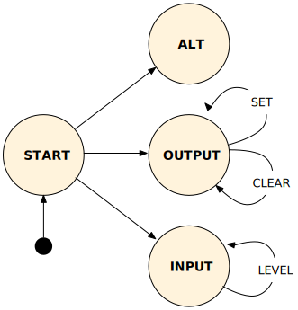

考虑GPIO相关的寄存器后，其定义如下：

```rust
const GPIO_BASE: usize = IO_BASE + 0x200000;
//引脚函数定义
pub enum Function {
    Input = 0b000,
    Output = 0b001,
    Alt0 = 0b100,
    Alt1 = 0b101,
    Alt2 = 0b110,
    Alt3 = 0b111,
    Alt4 = 0b011,
    Alt5 = 0b010
}
//GPIO相关寄存器
struct Registers {
    FSEL: [Volatile<u32>; 6],
    __r0: Reserved<u32>,
    SET: [WriteVolatile<u32>; 2],
    __r1: Reserved<u32>,
    CLR: [WriteVolatile<u32>; 2],
    __r2: Reserved<u32>,
    LEV: [ReadVolatile<u32>; 2],
    __r3: Reserved<u32>,
    EDS: [Volatile<u32>; 2],
    __r4: Reserved<u32>,
    REN: [Volatile<u32>; 2],
    __r5: Reserved<u32>,
    FEN: [Volatile<u32>; 2],
    __r6: Reserved<u32>,
    HEN: [Volatile<u32>; 2],
    __r7: Reserved<u32>,
    LEN: [Volatile<u32>; 2],
    __r8: Reserved<u32>,
    AREN: [Volatile<u32>; 2],
    __r9: Reserved<u32>,
    AFEN: [Volatile<u32>; 2],
    __r10: Reserved<u32>,
    PUD: Volatile<u32>,
    PUDCLK: [Volatile<u32>; 2],
}
//GPIO
pub struct Gpio<State> {
    pin: u8,
    registers: &'static mut Registers,
    _state: PhantomData<State>
}
```

其中用到的寄存器作用如下：

| 寄存器名称 | 描述                       |
| ---------- | -------------------------- |
| FSEL       | 存储引脚当前执行的函数编号 |
| SET        | 输出模式下启动引脚         |
| CLR        | 输出模式下关闭引脚         |
| LEV        | 存储当前引脚接收到的电平   |

我们为GPIO实现了以下方法，主要在UART单元中使用：

```rust
//创建一个未初始化的，编号为pin（1-52）的GPIO实例
pub fn new(pin: u8) -> Gpio<Uninitialized> {}
//GPIO引脚状态转换，内部函数
fn transition<S>(self) -> Gpio<S> {}
//转换到编号为function的Alt状态
pub fn into_alt(self, function: Function) -> Gpio<Alt> {}
//转换到输出状态
pub fn into_output(self) -> Gpio<Output> {}
//转换到输入状态
pub fn into_input(self) -> Gpio<Input> {}
//输出状态下启动引脚
pub fn set(&mut self) {}
//输出状态下关闭引脚
pub fn clear(&mut self) {}
//输入状态下检测电平高低，高电平返回true，低电平返回false
pub fn level(&mut self) -> bool {}
```


#### 3. UART接口（```uart.rs```）

UART，指通用异步收发传输器，将要传输的资料在串行通信和并行通信之间加以转换。作为把并行输入信号转成串行输出信号的芯片，它通常被集成于其它通讯接口的连结上。在我们的项目中实现的shell将同在树莓派上的UART设备进行数据传输。我们可以通过UART传输任何类型的数据，在本项目中通常是文本消息（命令、文本文件、消息文本等）。

UART作为异步传输设备，不使用时钟信号进行同步，故类似于XMODEM协议，它传输的数据添加了起始和终止位来进行传输，并可以设置1位奇偶校验位。

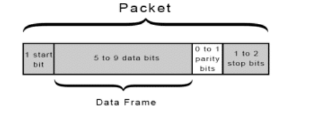

而下图非常形象地展示了并串并的数据传输过程。


这种方式具有使用数据线数量少、无需时钟信号、常规化的优点，但也有数据帧过小、波特率需要两端匹配的缺点。不过对于本项目中实现的shell来说，UART已经绰绰有余。

我们实现的UART驱动定义如下：

```rust
const MU_REG_BASE: usize = IO_BASE + 0x215040;
const AUX_ENABLES: *mut Volatile<u8> = (IO_BASE + 0x215004) as *mut Volatile<u8>;
//状态位表示
enum LsrStatus {
    DataReady = 1,
    TxAvailable = 1 << 5,
}
//UART相关寄存器
struct Registers {
    AUX_MU_IO_REG:  Volatile<u32>,
    AUX_MU_IER_REG: Volatile<u32>,
    AUX_MU_IIR_REG: Volatile<u32>,
    AUX_MU_LCR_REG: Volatile<u32>,
    AUX_MU_MCR_REG: Volatile<u32>,
    AUX_MU_LSR_REG: Volatile<u32>,
    AUX_MU_MSR_REG: ReadVolatile<u32>,
    AUX_MU_SCRATCH: Reserved<u32>,
    AUX_MU_CNTL_REG:Volatile<u32>,
    AUX_MU_STAT_REG:ReadVolatile<u32>,
    AUX_MU_BAUD    :Volatile<u32>,
}
//树莓派的MiniUart
pub struct MiniUart {
    registers: &'static mut Registers,
    timeout: Option<u32>,
}
```

同时为其实现的一些接口函数如下，在其中使用到了GPIO引脚驱动：

```rust
//生成一个MiniUart实例
pub fn new() -> MiniUart {}
//写入byte字节
pub fn write_byte(&mut self, byte: u8) {}
//检测是否有等待读取的字节，若有则返回true
pub fn has_byte(&self) -> bool {} 
//阻塞直到有字节等待读取
pub fn wait_for_byte(&self) -> Result<(), ()> {}
//读取一个字节
pub fn read_byte(&mut self) -> u8 {} 
```

该单元主要在shell的实现中使用。

#### 4. 中断控制（```interrupt.rs```）

在AArch64中，中断和异常的主要区别在于中断的产生是异步的，由外部设备响应事件而生成。随之产生的中断流如下：


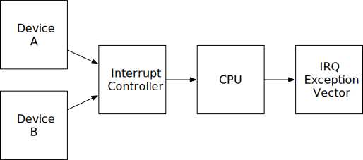

在本项目中，为了产生实现轮转法调度的时间片，需要产生计时中断。在这里主要介绍中断控制驱动。

```rust
const INT_BASE: usize = IO_BASE + 0xB000 + 0x200;
//中断编号
pub enum Interrupt {
    Timer1 = 1,
    Timer3 = 3,
    Usb = 9,
    Gpio0 = 49,
    Gpio1 = 50,
    Gpio2 = 51,
    Gpio3 = 52,
    Uart = 57,
}
//中断控制相关寄存器
struct Registers {
    pending_basic: Reserved<u32>,
    pending: [ReadVolatile<u32>; 2],
    fiq: Reserved<u32>,
    enable: [Volatile<u32>; 2],
    enable_basic: Reserved<u32>,
    disable: [Volatile<u32>; 2],
    disable_basic: Reserved<u32>,
}
//中断控制
pub struct Controller {
    registers: &'static mut Registers
}
```

其中用到的寄存器作用如下：

| 寄存器名称 | 描述             |
| ---------- | ---------------- |
| pending    | 储存中断提交状态 |
| enable     | 中断使能寄存器   |
| disable    | 中断禁用寄存器   |

我们实现的中断控制驱动应该能够获取设备发送的中断信号并根据当前条件予以处理或放弃，故关于```Controller```必须实现如下的函数，而这些函数主要在OS层面实现中断处理的时候调用：

```rust
//创建一个中断控制实例
pub fn new() -> Controller {}
//启用int类型的中断
pub fn enable(&mut self, int: Interrupt) {}
//禁用int类型的中断
pub fn disable(&mut self, int: Interrupt) {}
//检测是否收到int类型的中断
pub fn is_pending(&self, int: Interrupt) -> bool {}
```

更高层次的中断处理详见“中断”章节。


### File System

本项目实现的是对 MBR 分区格式下的 FAT32 文件系统的读取能力。

#### FAT32 文件系统

##### FAT32 结构

MBR 分区格式下 FAT32 文件系统的物理结构层次如下：

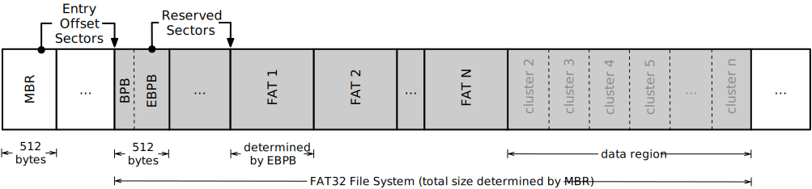

##### Master Boot Record

如图所示，MBR 位于磁盘上 0 号扇区（一个扇区大小一般是 512字节），MBR 结构如下。

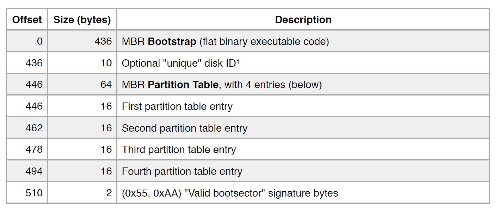

从图中可以看出，一个 MBR 包含四个分区表记录（这也是为什么 MBR 分区格式最多只能有 4 个主分区），每个分区表的结构如下：

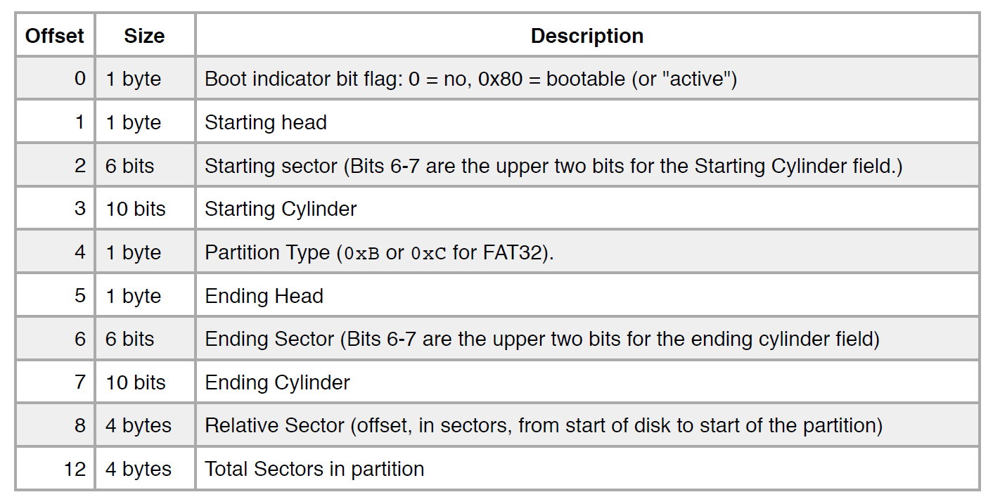

其中最重要的两项是 Relative Sector，表示从磁盘开头到这个分区起始地址的偏移。

##### Extended Bios Parameter Block

FAT32 分区的第一个扇区的内容是 Extended Bios Parameter Block（EBPB），这个结构定义了 FAT 文件系统的结构层次。里面最重要的一项之一是“number of  reserved sectors”，表示从 FAT32 文件系统起始到 File Allocation Table 的扇区数。

##### Entry & Cluster Chain

一个 FAT 里面有众多记录（Entry），在 FAT32 文件系统中，一个 Entry 是 32 位宽，这也是其名字里面“32”的来源。在（一个或多个）FAT 后是大量 Clusters，Entry`n`和 Cluster`n`对应，32 位宽的 Entry 内部是后面的 Clusters 之间的组织关系，Cluster 存储着数据。

Entry 的值的意义如下。

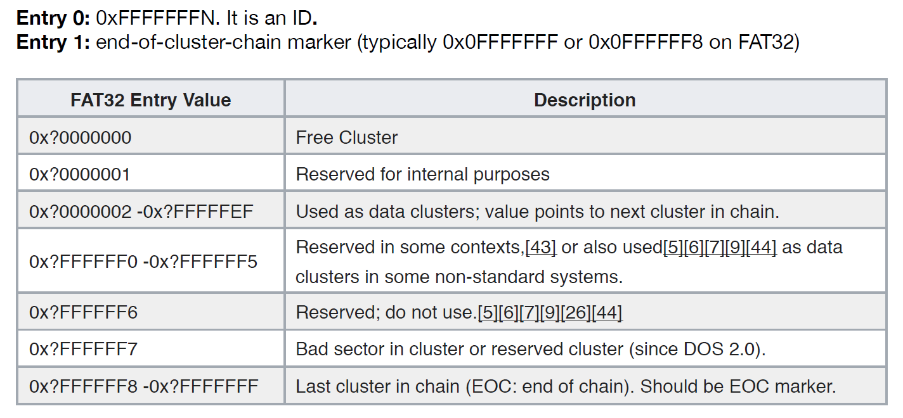

一个有 8 个 Entry 的 FAT 如图所示：

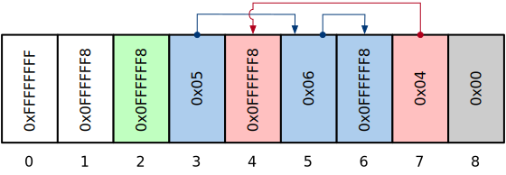

举其中一个 Cluster Chain 的例子，Entry 3 的值是 0x05，表示下一个 Cluster 是 Cluster 5，Entry 5 的值是 6，表示下一个 Cluster 是 6，而 Entry 6 的值是 EOC，所以这个 Cluster Chain 是 3 -> 5 -> 6。

一个 Cluster Chain 既可能是文件也可能是目录，目录可以看成是若干个目录 Entry 的排列，每个 Entry 最重要的信息有：名字、修改时间、创建时间、访问时间、是文件还是目录、起始 Sector 的编号。

为了能够使用长度大于 11 个字符的文件名，FAT32 引入了 Long File Name (LFN) Entry，具体来说，一个 Directory Entry 既可以是常规的 Entry，也可以是 LFN Entry。

#### 代码结构

File System 这一部分得益于老师给的详细的说明文档和清晰的框架，只需要一点点按说明完成各个结构体定义、函数编写即可，其实是个体力活。在名为`fat32`Rust 项目中，主要的源代码文件有：

```
─── src
    ├── mbr.rs
    └── vfat
        ├── cache.rs
        ├── cluster.rs
        ├── dir.rs
        ├── ebpb.rs
        ├── entry.rs
        ├── fat.rs
        ├── file.rs
        ├── metadata.rs
        ├── shared.rs
        └── vfat.rs
```

下简要介绍每个文件的主要功能。

##### mbr.rs

定义`MasterBootRecord`结构体，并实现了从块设备中获得`MasterBootRecord`的`from()`方法。

##### cache.rs

定义`CachedDevice`结构体，它利用`HashMap`实现了对块设备中 Sector 的缓存访问。

##### cluster.rs

定义`Cluster`结构体，由于 Entry 的 32 位宽的高 4 位总是被忽略，因此`Cluster`的`from()`方法只需要将`raw_num`的高 4 位变成 0 即可。

##### dir.rs

定义`Dir`、`VFatRegularDirEntry`、`VFatLfnDirEntry`，实现了能遍历一个目录所有 Entry 的`entries()`方法。

##### ebpb.rs

和`mbr.rs`非常类似：定义`BiosParameterBlock`结构体，并实现了从块设备中获得`BiosParameterBlock`的`from()`方法。

##### entry.rs

提供对一个不知道是目录还是文件的 Entry 的获取 name、metadata 的方法，以及尝试作为目录、尝试作为文件（都返回`Option<...>`）的方法。

##### fat.rs

定义`FatEntry`结构体，根据其内容返回相应 Entry 的含义，即“翻译”了下图：


##### file.rs

定义`File`结构体，主要实现了读文件的`read()`方法和文件内寻址的`seek()`方法。

##### metadata.rs

根据 Entry 的信息返回修改时间、创建时间、访问时间、是否是 LFN、是否只读、是否是目录等信息。

##### shared.rs

用于安全地分享对某个对象的“mutable”访问。

##### vfat.rs

是工作量最大的一个目录，定义了`VFat`结构体，它就是 FAT32 文件系统本身，包含了从其定义亦可看出：

``` rust
pub struct VFat {
    pub device: CachedDevice,
    pub bytes_per_sector: u16,
    pub sectors_per_cluster: u8,
    pub sectors_per_fat: u32,
    pub fat_start_sector: u64,
    pub data_start_sector: u64,
    pub root_dir_cluster: Cluster,
}
```

主要提供了读取 Cluster、读取 Cluster Chain 的方法。

### Interrupt & Exception

#### ARM 对 Interrupt & Exception 的分类

ARMv8 CPU 有4种 Exception Level：

- EL0 (user) - 用户进程 Typically used to run untrusted user applications.
- EL1 (kernel) - 操作系统内核 Typically used to run privileged operating system kernels.
- EL2 (hypervisor) - 虚拟机 Typically used to run virtual machine hypervisors.
- EL3 (monitor) - 底层硬件 Typically used to run low-level firmware.

树莓派启动时处于 EL3 ，切换至 EL2 后加载操作系统内核，在内核中切换至 EL1 。ELR,SPSR,SP 这样的系统寄存器每个 EL 都有独立的一套。

从高等级 EL 切换到低等级只有一种方式：eret 指令，即 exception return。从低等级陷入到高等级只有一种情况：触发exception。两种情况下CPU都会自动保存或恢复运行状态。

ARMv8 中 exception 有4种种类：

- Synchronous - 进程可以触发的，比如系统调用 an exception resulting from an instruction like svc or brk
- IRQ - 外部中断，比如计时中断 an asynchronous interrupt request from an external source
- FIQ - 比 IRQ 高级的外部中断 an asynchronous fast interrupt request from an external source
- SError - 系统错误 a “system error” interrupt

也有4种来源：

- Same exception level when source SP = SP_EL0
- Same exception level when source SP = SP_ELx
- Lower exception level running on AArch64
- Lower exception level running on AArch32

一共16种 exception, 中断矢量表也一共有16个入口地址。幸运的是，我们可以：

```ARM
#define HANDLER(source, kind) \
    .align 7; \
    stp     x30, x0, [SP, #-16]!; \
    mov     x0, ##source; \
    movk    x0, ##kind, LSL #16; \
    bl      context_save; \
    ldp     x30, x0, [SP], #16; \
    eret
```

定义统一的处理函数。然后在矢量表的对应位置放置 HANDLER(source, kind)，汇编器就会展开成相应汇编。

#### exception 处理

先介绍 trap frame。

##### trap frame

为了完成上下文切换工作，需要将当前各寄存器入栈。入栈顺序有要求，图解：


保存之后，这个栈包含了恢复中断前程序执行的所有内容，称之为 trap frame。

- ELR ：中断返回地址，就是进程当前执行到的地址
- SPSR ：中断前的一些程序信息
- SP ：中断前栈指针

为了能在rust 里访问这个栈，并方便的进行数据处理，TrapFrame 是作者为保存所有寄存器的状态所设立的结构体。可见，结构体里的每个域的内存位置，刚好对应每个需要保存的寄存器的入栈位置。

```rust
pub struct TrapFrame {
    pub ELR: u64,
    pub SPSR: u64,
    pub SP: u64,
    pub TPIDR: u64,
    pub q0_q32: [u128; 32],
    pub x1_x29: [u64; 29],
    pub __res: u64,
    pub x30: u64,
    pub x0: u64
}
```

##### exception 处理的过程

HANDLER(source, kind) 会调用汇编的 context_save ,完成各寄存器入栈工作，然后调用 handle_exception 函数。后者解析参数，知道exception的种类和来源之后，分类处理。系统调用 syscall 则调用 handle_syscall 函数，中断则调用 handle_irq 函数。

完成后，返回到汇编的 context_restore ,完成出栈工作。如果是计时中断完成上下文切换，则此时的栈内容，即 trap_frame 已经换成新进程的了。最后返回到 HANDLER(source, kind) ，eret 到原来的程序或新进程里。

#### syscall

目前只实现了一种系统调用：sleep. 可在 shell 里调用。

更多系统调用可待来日升级。

#### interrupt

目前亦只特殊处理一种中断：为进程调度服务的计时中断。发生时，会调用 GlobalScheduler::switch() 完成一次进程切换，并设置下一个计时中断。

更多中断处理可待来日升级。

### Process

>A process is a program in execution.

一个比较完善的 OS 里，一个进程的全部信息、数据包括：

- 内存中分配的栈与堆
- 内存中的代码
- 虚拟地址空间
- 所有寄存器的值

为了进程的安全，管理，调度，操作系统可见的进程信息还包括：

- Id
- 调度状态 Scheduling state

而 cs140e 中，由于还要一部分后续课程没有发布，所以我们仅仅按照已经发布的部分完成了：

- 栈
- 代码
- 所有寄存器的值
- Id
- 调度状态 Scheduling state

尚未实现的堆与虚拟内存空间，作者将会在未来的课程实验里发布，也将是这个操作系统改良的方向之一。

#### Stack

按照作者的实现，初始化时为每一个进程分配的栈空间固定为 1MiB。

#### State

操作系统维护的进程状态有三种，State 这个 enum 的定义如下：

```rust
pub enum State {
    Ready,                  /// The process is ready to be scheduled.
    Waiting(EventPollFn),   /// The process is waiting on an event to occur before it can be scheduled.
    Running,                /// The process is currently running.
}
```

分别对应程序可以换入，程序正在等待某个事件发生，程序正在执行。其中 Waiting 一项有一个参数 EventPollFn ，是一个操作系统判断事件是否已经发生的函数。

#### Scheduler

依照作者的实验要求，调度算法采用 round-robin 时间片轮转。每一个时间片的大小暂定为100ms。未来考虑加入更好更灵活的调度方案。

实现调度算法，Scheduler 维护了一个进程的队列，队列中包含所有的 Ready 与 Waiting 的进程。

每当 Timer1 的计时中断发生时，也就意味着当前进程的时间片耗尽，系统跳转到中断服务程序，后者调用 Scheduler::switch()。Scheduler 首先将换出进程入队，然后会不断将队头进程出队，如果那个进程状态为 Waiting ，并且 EventPollFn 为 false, 则将其挪到队尾。状态为 Ready 或 Waiting 且 EventPollFn 为 true,则选择其作为换入进程，如此往复。

换入换出的各种具体工作，如寄存器值的保存则由 init.S 文件中的 context_save,context_restore 段的汇编代码来完成。

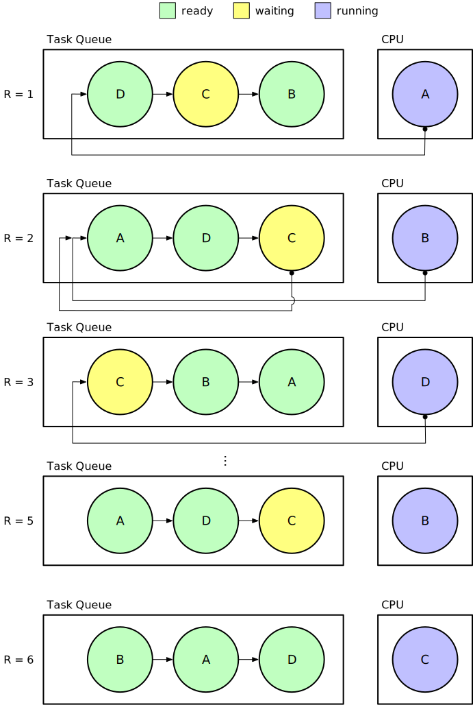

scheduler 还有函数 add() ，作用是往队列中增加一个新进程，并分配进程 Id。

#### 难点：第一个进程的建立

第一步总是最难的。在系统里没有进程时，上下文切换会出错。因此必须在内核中调用 GlobalScheduler::Start() 函数来创建、启动第一个进程，并切换到那个进程里。

GlobalScheduler::Start() 具体实现上，可以启动多个进程。调用 Process::new() 建立新进程，把进程的起始地址、栈指针、中断等级信息填入进程的 trap_frame 的对应 ELR,SP,SPSR 域，调用 add() 函数，就往系统中增加了新的进程。调用 Controller::enable() 函数开中断，并调用 tick_in(TICK) 函数设置下一个时间片的中断，再通过中断服务例程的 context_restore 来完成换入。

执行了 GlobalScheduler::Start() 之后，系统便开始在 EL0 运行第一个进程：shell。

#### 具体实现

Process 结构体的定义如下：

```rust
pub struct Process {
    pub trap_frame: Box<TrapFrame>,
    pub stack: Stack,
    pub state: State,
}
```

trap_frame 域为一个 Box 智能指针，指向前文提到的 trap frame 结构体。stack 域即为进程的栈，state 域为进程的状态。

Process 实现的方法有：

- new() -> Option<Process>

  尝试创建一个进程，并尝试为其分配栈空间，设置其状态。

- get_id(&self) -> u64

  读取其 trap_frame 域的 TPIDR 域，获得其进程 Id。

- is_ready(&mut self) -> bool

  判断这个进程可不可以被 Scheduler 换入。

调度器代码分为两层。上层为 GlobalScheduler 结构体，包含下层的 Scheduler 结构体。Scheduler 定义如下：

```rust
struct Scheduler {
    processes: VecDeque<Process>,  //进程队列
    current: Option<Id>,           //拥有时间片的进程Id
    last_id: Option<Id>,           //最近加入队列的进程Id
}
```

Scheduler 的方法有：add() 和 switch() ,上文已经介绍过。GlobalScheduler 的 add() 和 switch() 则是前二者的封装，分别被操作系统和中断服务程序调用，完成进程的增加和上下文切换工作。GlobalScheduler::Start() 功能也如上文所述，完成创建系统进程和开始第一个过程的工作。

### Shell


## Get Started

### 软硬件环境

#### 硬件

- 树莓派 3B+
- CP2102 USB to TTL 转接线
- Micro SD 卡
- 读卡器

#### 软件

安装 Rust

```bash
$ curl https://sh.rustup.rs -sSf | sh
```

更改 Rust 工具链版本

```bash
$ cargo install --version 0.3.10 xargo
$ rustup default nightly-2018-01-09
$ rustup component add rust-src
```

### 安装 aarch64-none-elf 工具

``` bash
$ wget https://cs140e.sergio.bz/files/aarch64-none-elf-linux-x64.tar.gz
$ tar -xzvf aarch64-none-elf-linux-x64.tar.gz
```

将`aarch64-none-elf/bin`目录添加到`PATH`环境变量即可。

### 克隆项目

``` bash
$ git clone https://github.com/OSH-2019/x-i-m-feeling-lucky
$ cd x-i-m-feeling-lucky
```

### 安装 ttywrite 工具

``` bash
$ cd cs140e/1-shell/ttywrite
$ cargo install
```

> 若出现类似`error: non-string literals in attributes, or string literals in top-level positions, are experimental`的错误，需按照提示在某文件中添加`#![feature(attr_literals)]`。要添加这一行的文件需要根据报错的文件位置来确定，具体方法为，若报错的文件为`*/src/../..*rs`，则在`*/src/lib.rs`中添加`#![feature(attr_literals)]`。若下文中出现同样报错，再次按此操作即可。

### 在 Micro SD 中放入启动必需文件

启动必需文件有 4 个：`start.elf`, `bootcode.bin`, `config.txt`,  `kernel8.img`。

从 https://github.com/raspberrypi/firmware/tree/master/boot 下载`start.elf`和`bootcode.bin`文件，新建文本文件`config.txt`，内容如下：

```
kernel_address=0x4000000
device_tree=
```

获取`kernel8.img`：

``` bash
$ cd cs140e/os/bootloader
$ make
$ cp build/bootloader.bin kernel8.img
```

> 也可以在`cs140e/os/files_used_to_boot`文件夹下直接找到这 4 个文件。

把 Micro SD 卡用 MBR 分区表建立一个 FAT32 分区，将这 4 个文件放入分区根目录内。

### 连接设备

Micro SD 卡插入树莓派中，使用 USB to TTL 转接线将树莓派和电脑相连，连接方式如下。


### 运行

进入`/dev`文件夹，找到`ttyUSB`开头的一项，记下这个名字，然后将`cs140e/os/kernel/Makefile`中`PI_TTY ?= /dev/ttyUSB0`做相应修改。

在`kernel`目录下执行命令：

``` bash
$ make install
```

如果出现访问`/dev/ttyUSB*`权限不足的问题，需要将您当前的用户添加到`/dev/ttyUSB*`所在组中：

首先获取其所在组：

``` bash
$ ls -la /dev/ttyUSB*
```

若输出结果如下，说明其所在组为`dialout`。

```
crw-rw---- 1 root dialout 188, 0 Jul  5 19:43 /dev/ttyUSB0
```

将当前用户添加到该组中：

``` bash
$ sudo adduser $(whoami) dialout
```

注销并重新登录，再次使用`make install`传输`kernel.bin`文件。

待传输完成后，执行命令：

``` bash
$ screen /dev/ttyUSB0 115200 # if your TTY device differs, modify ttyUSB0 appropriately.
```

Enjoy it!


## 前景展望

CS140e 课程内容是使用 Rust 语言为树莓派写一个简易的操作系统，我们对其前景的理解是“Rust 可以用来写操作系统，而且 Rust 也可以写出来优秀的操作系统”，实际上，Rust 写出来的成熟的操作系统已经有很多，特别是 Redox，CS140e 课程所完成的操作系统当然没法和这些已经相当成熟的操作系统相比，只是这个课程让参与的学生使用 Rust 亲自实现了一个简单的操作系统，让他们明白了 Rust 写操作系统的理论上、实践上的可行性。回到我们自身，我们在课程刚开始的时候的一些设想，比如接上键盘、显示器，成为真正独立的计算机，在我们使用 Rust 的能力进一步提高后是完全可行的，毕竟，Rust 可以按照 XMODEM 协议来实现串口通信、可以在底层上完成 FAT32 文件系统的访问接口，为什么就不能完成对键盘的驱动、对显示器的支持？

我们的项目虽然远远比不上成熟的 Rust 操作系统，但是他们的前景是一样的：Rust 可以写出来像 Linux、Windows 一样优秀的系统。

## 总结分析

### 优点和收获

#### 贴近 OS 课程本身

CS140e 课程和我们这学期的 OSH 课程在内容上高度相关，只是在形式上，前者重在实践，后者重在理论。通过这个大作业，我们在 OSH 课程学到的很多操作系统相关的理论得到了实践。

刘云飞了解了树莓派的硬件结构，并在此基础上完成了底层系统调用接口，加深了对操作系统整体架构、软硬件接口的理解。

余磊在完成只读 FAT32 文件系统的过程中，大大加深了对文件系统的理解，实现了一个简易 Cache，并能从 FAT32 文件系统的标准中体会到微软对兼容性的追求，比如引入 Long Filename (LFN) 来向后兼容 DOS 下的 8.3 Filename (Short Filename)。

李维晟在处理进程相关内容时，加深了对进程从启动、切换、销毁这一系列过程的理解，还亲自体验了死锁的发生，在时间片大小的调整上也花费了不少功夫，最后终于找到了一个合适的大小。

汪若辰在完成 Shell 的过程中，调用到了余磊完成的文件系统的接口、刘云飞完成的系统调用的接口，并在提高 Shell 可用性、友好性方面下了一番功夫（比如支持在 Shell 中使用左右方向键移动光标、上下方向键在历史记录中切换），而底层提供接口、Shell 调用接口、编写更友好的 Shell……这些正是操作系统的设计原则。

总的来说，我们四人在每个人侧重的那一部分，都能找到和 OSH 课程的联系，实践、遇到问题、回顾 OS 课程、再次实践……我们在这个循环往复的过程中，不断加深了自己对 OS 课程所学内容的理解。

#### 初步掌握了 Rust 语言

我们组学习 Rust 的路线是，先学习 Rust 的基本语法（主要通过[The Rust Programming Language book](https://doc.rust-lang.org/book/)完成），接着我们就开始边做边学，碰到老师给的源代码里的没太懂或是没见过的高级一些的语法、函数，就去 Rust 的标准库里去找。我们这么做主要是基于时间原因，毕竟我们根本没有时间在做 CS140e 之前先完成一些简单的 Rust 项目学习 Rust。显然，这种边做边学的学习方式还挺费力，特别是刚刚接触的那段时间，更是如此。好在，做到后面，就慢慢变得得心应手了一些。

### 缺点和不足

#### 对课程所作的拓展有限

在大作业刚开始的时候，我们设想过要对 CS140e 课程做一些拓展，听取了老师的指导意见，并结合我们自己的想法，我们当时初步的方案有：让树莓派接上显示器、键盘，成为真正独立的计算机，而不是依靠串口通信通过其它设备和它交互；把项目抽象化，脱离树莓派具体的硬件。

但是在后期要完成课程内容的时候，我们才意识到自己的能力的局限性，首先第二个方案“抽象化、脱离具体硬件”这个确实需要很深的知识储备和项目能力，我们本身对这个抽象的理解十分有限，不知道从哪里入手；其次是第一个方案，我们在调研后发现，其实树莓派接显示器这一点不困难，因为树莓派已经把 HDMI 的显示做了相当的抽象，提供了非常友好的接口，只需要向对应的地址写入要显示的数据即可，而不需要自己处理屏幕显示的诸如时序、扫描等等很复杂的东西；显示器不困难，困难的是键盘，我们要在相当底层的地方完成对键盘的驱动，这个亦超出我们的能力水平，而如果只接显示器，不接键盘而是用串口通信在其它设备上来输入的话，这样还是不能让树莓派独立起来，显示器就显得相当鸡肋，因此，我们最后也放弃了这个计划。

到最后，我们对课程所作的扩展就只是对 Shell 功能的扩充了，我们的 Shell 程序支持`echo`、`pwd`、`cd`、`ls`、`cat`、`allocator`（显示当前内存分配情况）、`sleep`（是一个系统调用）命令，还支持左右方向键移动光标、上下方向键在历史记录中切换。

#### 利用 Rust 语言的工程能力不足

这一点其实和前一点“对课程所作的拓展有限”基本上是一个问题。CS140e 课程中，老师给了相当友好的框架，学生只需要补充留空的函数、完成结构体定义、适当编写自己的辅助函数，因此不需要太强的 Rust 工程能力。但是当我们想对课程做拓展的时候，需要我们自己定义一堆接口，自己完成软件和软件之间、软件和硬件之间的交互，就会意识到我们的能力还有很大欠缺。

### 补充

在大作业的前期我们遇到了 Rust 工具链版本的问题。

简单来讲，使用 Rust 的 CS140e 课程的时间是 2018 年上半年，而后面的 CS140e 就是使用 C 语言了，从 2018 年上半年到 2019 年的这一段时间，Rust 作为一门相当年轻的语言，变化非常快，而且中间经历了大版本的变更（课程中的 Rust 版本是 Rust 2015，而现在是 Rust 2018），导致里面很多函数要么是位置从一个库变到另一个库，要么是直接消失，另外课程使用的交叉编译工具 Xargo 也不再维护，这就使得使用最新的 Rust 工具链会有相当多的报错。

于是，我们就面临着一个选择：使用当时的工具链还是说使用现在最新的。后来我们认为，如果选择最新的工具链，虽然能够学习到最新的 Rust 版本，有利于语言的学习（想象一下，你花了很久的时间学习了一门编程语言的 旧版本，而这门语言变化很快，而且现在最新的版本和旧版本之间还差了一个大版本，后来你想使用 Rust 语言写点东西，却发现自己常用的那一套要么改名了、要么没了，或者还有更新更好的方法你不知道），但是使用最新的版本的风险在于，如果只是函数位置的更改、crate 的更名，那么我们还好改，但是如果是一些实现方法没了，而是使用新版本的某些方法替代，由于我们刚刚接触 Rust，就有一定风险我们根本没法处理好这个问题，结果完不成课程。

因此，为了稳妥，我们选择了使用和课程版本一样的工具链：

```bash
$ cargo install --version 0.3.10 xargo # 使用旧版交叉编译工具 Xargo
$ rustup default nightly-2018-01-09 # Rust 版本切换到 2018-01-09 (1.25.0)
```

## 


## 参考资料

- [BrokenThorn Entertainment](http://www.brokenthorn.com/Resources/OSDevIndex.html)

- [Stanford CS140e - Operating Systems](https://cs140e.sergio.bz/)

- [Rust Documentation](https://doc.rust-lang.org/stable/)

- [Writing an OS in Rust](https://os.phil-opp.com/)

- [rust-embedded/rust-raspi3-OS-tutorials: Rust bare-metal and OS tutorials on the Raspberry Pi 3](https://github.com/rust-embedded/rust-raspi3-OS-tutorials)

-  [BrokenThorn Entertainment](http://www.brokenthorn.com/Resources/OSDevIndex.html)

-  [Redox Book](https://doc.redox-os.org/book/)
