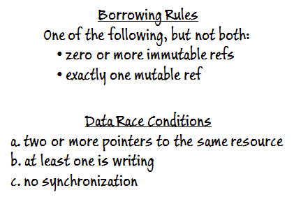

# 结题报告


## 项目名称

<big>**Implementing an OS for Raspberry Pi 3 in Rust**</big>

## 项目介绍

使用 Rust 编程语言写一个能在树莓派上运行的操作系统。

**硬件设备**

- 树莓派 3B+（OSH 课程统一发放）；
- Micro SD 卡 （OSH课程统一发放）；
- CP2102 USB to TTL 转换器；
- 读卡器。

**学习资源**

- ***OSH 课程和教材***；

- [***CS140e 课程***](<https://cs140e.sergio.bz/>)；

- [Writing an OS in Rust](https://os.phil-opp.com/second-edition/) By Philipp Oppermann；

- [Rust 官方文档](https://doc.rust-lang.org/stable/)；

- [rust-raspi3-OS-tutorials](<https://github.com/rust-embedded/rust-raspi3-OS-tutorials>) on Github.com；

- [CS140e](<https://www.reddit.com/r/cs140e/>) on Reddit.com；

  ……

**概要**

主要参考斯坦福大学 2018 年 CS140e 课程，在树莓派上完成一个操作系统的基本组成（引导、文件系统、内存系统、进程管理等），先达成能上机跑起来的目标（连接显示器，开机后能够显示一个Shell，提供对常用命令的支持）。若仍有余力，将在某些部分（如进程调度、文件系统）上做进一步优化。**本项目重点不在做出什么新东西，做出什么比 [Redox](<https://www.redox-os.org/>) 更好的东西，而是试图通过“造轮子”的过程，将 OSH 课上学的东西用起来。**


## 立项依据

> 节选自可行性报告。

### 理论依据

### 1. Raspberry Pi

#### 1.1 About Raspberry Pi

树莓派（Raspberry Pi），是一款基于Linux的单片机计算机。它由英国的树莓派基金会所开发，目的是以低价硬件及自由软件促进学校的基本计算机科学教育

#### 1.2 Hardware of Raspberry 3B+

- 处理器：博通 BCM2837B0 SoC，集成四核 ARM Cortex-A53（ARMv8）64位 @ 1.4GHz CPU，集成博通 Videocore-IV GPU；
- 内存：1GB LPDDR2 SDRAM；
- 有线网络：千兆以太网（通过 USB2.0 通道，最大吞吐量 300Mbps）；
- 无线网络：2.4GHz 和 5GHz 双频 Wi-Fi，支持 802.11b/g/n/ac；
- 蓝牙：蓝牙 4.2 & 低功耗蓝牙（BLE）；
- 接口：HDMI 接口，3.5mm 模拟音频视频插孔，4 x USB 2.0 接口，RJ45 以太网口，摄像机串行接口（CSI），显示器串行接口（DSI），Micro SD 插槽，40 Pin 扩展双排插针。


#### 1.3 How it boots?

 树莓派支持 Micro SD card 启动和 USB 启动，由于我们只用到 Micro SD card 启动方式，因此接下来将只介绍它。

##### 1. 第一阶段 bootloader

树莓派上电后，GPU 核心启动，GPU 开始执行第一阶段的 bootloader (`bootloader.bin`)。bootloader 读取 SD 卡，将第二阶段的 bootloader (`start.elf`) 加载到 GPU，`start.elf`开始执行。

##### 2. 第二阶段 bootloader

`start.elf `检索附加配置文件（`config.txt`、`fixup.dat`），按照 `config.txt`来配置 ARM CPU，寻找`kernel*.img`文件，将其加载入内存，命令 CPU 开始执行`kernel*.img`中的程序。

### 2. Operating System

#### 2.1 About operating system

*An operating system (OS) is system software that manages computer hardware and software resources and provides common services for computer programs.* ([Wikipedia](https://en.wikipedia.org/wiki/Operating_system))

操作系统是一个管理硬件和软件资源、并为其它程序提供通用服务的系统软件。

#### 2.2 What features a modern OS?

- Memory Management

  动态地分配和回收内存；虚拟内存（一种能让实际使用内存容量大于物理容量的技术）……

- Program Management

  确保程序和程序间、程序和系统间的“隔离”，即程序不能破坏其它程序，更不能破坏系统；处理程序的请求（如程序申请内存和释放内存）……

- File System

  文件系统决定了数据在存储设备中怎么被存储和取得；

- Multitasking

  在多个程序间切换和分配时间帧（timeframe），并采用合适的调度策略；向用户提供任务管理器（如 Windows 下的任务管理器）；利用任务状态段（TSS，Task State Segment）实现任务切换……

- Memory Protection

  对针对内存的非法操作（如空指针操作、程序对自身的覆写等）识别和处理……

- Fixed Base Address

  固定基地址意味着程序总是用一个固定的加载入内存的地址，比如 BIOS 和 Bootloader；

- Multiuser

  用户管理和安全保护；用户间切换；是否允许多用户同时登陆……

- Kernel

  内核是操作系统最核心的部分，根据不同系统内核策略不同，内核所包括的部分不一（Microkernel 和 Monolithic Kernel）；

  

- Shell

  Shell 俗称“壳”，是指“为使用者提供操作界面”的软件，一般包括 Command Shell 和 Graphical Shell；

- Graphical User Interface (GUI)

  为用户提供友好的图形化界面，严格来说 GUI 在操作系统中并不重要，但是一般提到操作系统，人们大多会想到图形界面；

- Bootloader

  Bootloader 被 BIOS 加载，用来加载并运行内核。树莓派中的启动和普通电脑有些不同，前文已做叙述；

  ……

### 3. Rust Programming Language

#### 3.1 About Rust

Rust 是一个着重于安全性（特别是并发安全）的多重范型编程语言。Rust 在语法上和 C++ 类似，但是能够在保持高性能的同时提供更好的内存安全性。

<p align="center">

</p>

Rust 由 Mozila Research 的 Graydon Hoare 设计，Dave Herman、Brendan Eich 亦有贡献。

Rust 在 Stack Overflow 的 [2016](https://stackoverflow.com/insights/survey/2016#technology-most-loved-dreaded-and-wanted)、[2017](https://stackoverflow.com/insights/survey/2017#most-loved-dreaded-and-wanted)、[2018](https://insights.stackoverflow.com/survey/2018/#most-loved-dreaded-and-wanted) 年开发者调查中，是“最被喜爱的编程语言”。


Rust 是系统编程语言，专门用来编写以往由 C 或 C++ 编写的高性能程序，但是 C 和 C++ 非常容易出现一系列类似无效内存访问（segmentation faults）的问题，Rust 的出现就是为了避免类似问题的发生。 Rust 的一些重要特性如下。

- 模式匹配和代数型的数据类型（枚举）；
- 基于任务的并发性。轻量级的任务都可以在不共享内存的情况下并发运行；
- 高阶函数（闭包）；
- 多态性，结合类似 Java 的接口特性和 Haskell 的类类型；
- 泛型；
- 没有缓冲区溢出；
- 默认情况下不可变；
- 非阻塞的垃圾收集器。

#### 3.2 Why choose Rust?

##### 3.2.1 Why not assembly language?

早期的操作系统是用汇编语言编写的，但是后来的操作系统，几乎很少有完全用汇编语言编写的，完全用汇编语言而且还用户友好（主要指有图形界面）的更是少之又少（如 [KolibriOS](http://kolibrios.org/en/index), [MenuetOS](http://www.menuetos.net/download.htm)），为什么开发者大多不选择汇编语言作为 OS 的开发语言呢，主要有两点原因：

1. 工作量大。汇编语言可以看成是机器语言的助记表示，某种意义上写汇编和直接写机器代码没有本质区别，只不过前者更便于使用而已。汇编语言对寄存器和存储器的直接操控，使得其执行效率相比高级语言更高（这里的执行效率是指完成同样的功能所需要的底层操作的次数）。但是显然，汇编语言需要程序员去完成怎么存数据、怎么取数据、数据直接怎么计算等等操作，使得程序复杂度大大提高，可读性大大降低；
2. 不可移植。汇编有“机器相关性”，这个特性一方面使得汇编语言能够针对特定机器写出特定的程序，更好地发挥机器的性能；但是另一方面也使得汇编程序的可移植性大大降低。

基于这些原因，现代操作系统一般只在最底层部分（如内核和设备驱动程序）使用少量汇编语言，作为对 C 语言的补充，非底层部分则可以使用 C、C++、Java、Go 等语言开发。

##### 3.2.2 Why not application programming  language?

从理论上来讲，任何编程语言都可以用来写操作系统——甚至脚本语言也可以通过先生成机器码的引导程序来加载自己的解释器，然后执行脚本，如基于 Python 的操作系统 [pythonix](<https://github.com/wfxpanisa/pythonix>)，但是可以做并不意味着就适合做。

内核和设备驱动是操作系统的核心部分，而这两部分都需要和直接和硬件打交道，很多应用编程语言为了降低复杂度、提高安全性，选择隐藏底层细节，将硬件细节抽象化。这样在提高编程效率的同时，也决定了无法直接接触到底层硬件、无法对硬件高效管理，使得操作系统的运行效率不高。

##### 3.2.3 Why not C or C++?

C 和 C++ 既作为高级语言能够很容易被人理解，又能提供足够的底层支持。支持对内存的直接访问，支持指针操作，没有运行时（runtime）开销，支持 ***Assemby code inline***（可以简单理解成支持在高级语言程序里面插入汇编代码）…… 因为种种优秀的特性，C 和 C++ 在操作系统领域被大量使用，如 Windows 的内核主要由 C 编写，其它部分主要由 C 和 C++ 编写；Mac 的内核主要使用 C 编写；Linux 大部分都是由 C 编写。 但是 C 和 C++ 写的程序也往往有一些很严重的问题，如空指针、野指针、数据竞争等等，在日益追求安全性的今天，C 和 C++ 的安全性问题成为了巨大的隐患。

##### 3.2.4 Why Rust?

> Rust is a ***system*** programming language.

和应用编程语言（application programming  language）不同，系统编程语言（system programming language）大多具有如下特性：

1. 效率高，运行时（runtime）开销小；
2. 具有很小的运行库，或者没有；
3. 允许直接且“原始”地控制内存访问、控制流；
4. 允许直接以汇编语言编写部分程序。

过去的几十年，系统编程几乎一直都是 C 和 C++ 程序员的地盘，Rust 语言自 2015 年发布后，成为了一款对标 C++ 的系统编程语言。

Rust 既有 C 和 C++ 的速度和对底层的支持性，又有 ownship、lifetime、强类型、静态类型等安全特性（参见本报告下一部分），使得其成为了当前最适合接替 C 和 C++ 来写操作系统的语言。

### 技术依据

### 1. How Rust makes OS safe?

上节已经讨论了 rust 的一些安全特性，本节会介绍 rust 的这些特征如何在 OS 中体现出来。

#### 1.1 Enforced memory safety

先看一个 C 语言常见的 bug ：

```c
int *func (void)
{
    int num = 1234;
    int *p = &num;
    return p;
}

p = func();
```

这就是 C 语言悬空指针的问题。在调用 func 之后一段时间，尝试从该指针中读取 num 的值，可能仍然能够返回正确的值 (1234)，但是任何接下来的函数调用会覆盖原来的栈为 num 分配的空间。这时候对指针 `p` 进行读，就有可能获得这个程序本来没有权限获得的数据；改写 `p` 指针的内存则可能带来更灾难的后果，甚至使得系统崩溃。

rust 是这么做的：

```rust
fn main() {
    let reference_to_nothing = dangle();
}

fn dangle() -> &String {
    let s = String::from("hello");

    &s
}
```

我们试图使 `s` 悬空，但编译器会报错：

> this function's return type contains a borrowed value, but there is no value for it to be borrowed from.

此时指针的值 invalid, 编译器会阻止我们返回这个值。

然而这种 bug 非常基础，普通的 C 编译器也能发现。但在程序越来越复杂之后，悬空的指针可能隔了很多个函数才被调用，C 编译器就不够聪明了，但 rust 还是能在编译时发现这种问题。这正是 Ownership 的威力。

一个更有说服力的例子是数据读写的竞争冒险问题。操作系统课告诉我们，一个时候可以有很多个读者，或者只有一个写者，系统才能正常运行。以下是发生竞争冒险问题的条件：

- two or more pointers to the same resource
- at least one is writing
- the operations are not synchronized

而 rust 里的指针（称之为 reference），分为可变和不可变两种。不可变的指针只能读所指向的值，而可变指针可以写。在 rust 指针的数据结构层面，有如下规定：

1. the borrower’s scope must not outlast the owner
2. you can have one of the following, but not both:
   1. zero or more references to a resource; or
   2. exactly one mutable reference

如果不满足这些要求，编译器不会放行。规则 1 在我们的第一个例子里体现，而规则二则保证了竞争冒险问题永远不会发生，因为访问这些数据的指针的行为、数量被编译器限制了。



这些例子都只是 Ownership 的一部分。而在一个用 rust 写成的 OS 里，无处不受 Ownership 的约束。这正是其安全性的强大保证。

#### 1.2 Thread and concurrency safety

事实上，rust 的特性天然的解决并发的问题，而这也是 rust 语言项目的初衷之一。许多语言都支持线程有关的库，相关的 API ，rust 也是。但 rust 能更好的解决如下问题：

- Race conditions, where threads are accessing data or resources in an inconsistent order
- Deadlocks, where two threads are waiting for each other to finish using a resource the other thread has, preventing both threads from continuing
- Bugs that happen only in certain situations and are hard to reproduce and fix reliably

一个例子：

```rust
fn foo() {
    let mut ptr = Box:new(42);      // Allocate a pointer
    thread::spawn(|| {              // Spawn a thread
        *ptr = 0;                   // Modify the pointer
    });
}
```

```rust
fn foo() {
    let mut ptr = Box:new(42);      // Allocate a pointer
    thread::spawn(move || {         // Spawn a thread
        *ptr = 0;                   // Modify the pointer
    });
}
```

前一段代码会报错，而后一段不会。关于 ptr 所有权属于哪个指针的问题，后一段代码转移了 ptr 的所有权。

#### 1.3 Zero cost safety

零开销安全性也是 rust OS 非常重要的特点。这个特点的具体含义是，大部分确保安全的工作都在编译时完成，而不是在运行时再通过各种手段来提高安全性。上文的两个例子还会再次出现，它们也都是零开销安全性的绝佳体现。

- GC
  垃圾回收是避免上文所提例 1 的一个不错的方法，但并不是一个最优方案。比如，GC 机制是在运行时进行的，肯定会影响运行效率。而且就 JAVA 为例，如果我们不用去理解 GC 机制的原理，因为如果不了解其原理，可能会引发内存泄漏、频繁 GC 导致应用卡顿,甚至出现 OOM 等问题。而 rust 编译器与 Ownership 保证了指针不会悬空，可谓从源头上断绝了垃圾的产生。
- data race
  在其他操作系统中，有其他的手段来避免这个问题，比如信号量或管程。但和上例相似，都在运行时进行的。

zero cost safety 有很多优点，安全性、可靠性得到了很大提升，也提高了运行速度。

#### 1.4 `unsafe` 标签

rust 语句块可以加上 `unsafe` 标签。这句咒语就是告诉编译器：“相信我，一切都天衣无缝。”编译器会允许你做如下事情：

- Dereference a raw pointer
- Call an unsafe function or method
- Access or modify a mutable static variable
- Implement an unsafe trait

事实上完全 OS 中完全避免 `unsafe` 是不可能的。和底层硬件打交道， `unsafe` 行为有时候无法避免。

> A quick grep gives us some stats: the kernel has about 70 invocations of `unsafe` in about 4500 lines of code overall.

但这种机制还是给了我们很大便利。

- 程序员还是获得了一定程度上的控制权。没有这个标签，有时候会约束程序，使得程序员无法完成所需要的功能。
- 几乎整个 OS 都是安全的，bug 调试可以集中在 `unsafe` 的地方。
- 几乎整个 OS 都是安全的，这样可以在其基础上开发一些原来没有的模块、软件或功能，安全性反哺操作系统功能。
- 给了对操作系统了解不多，或者说对系统了解不多的程序员便捷开发一个新系统的机会。

### 2. Rust is feasible (Samples)

#### [Redox](https://redox-os.org/)

Redox 是一个使用 rust 编写的通用的类 Unix 操作系统。它的内核结构为微内核，内核的代码量约为 16000 行。Redox 不仅仅是个内核，而是个全功能的操作系统，它提供了内存分配器、文件系统、显示管理器等扩展，和内核本身共同构成了一个实用、便捷的操作系统生态。某种意义上可以把它理解成基于内存安全的编程语言的、加上一些现代技术的 GNU 或 BSD 生态。

#### [CS140e](https://cs140e.sergio.bz)

斯坦福在 2018 年冬季学期开设的 CS140e 是一个实验课，在课中学生们使用 rust 开发一个可以在树莓派 3 上运行的操作系统。课上的四个 assignments 依次为：

1. shell 和 bootloader；
2. SD 卡驱动和 FAT32 文件系统；
3. spawn, 在不同的进程中加载并执行位于 SD 卡上的程序；
4. multicore multitasking.

第四个 assignment 最后没有布置。另外还有一个 assignment 是搭建一个完整的操作系统。

由于大作业主要参考 2018 年的 CS140e，故参考该课程对工作量做一个估计。CS140e 的上课时间为两个月，根据 [这里](https://cs140e.sergio.bz/assignments/info/#work-load) 所说的，单人完成每周花费的时间为 10 -- 15 小时。在代码量方面，以 [jiegec/cs140e](https://github.com/jiegec/cs140e) 为参考，需要自己写的代码行数小于 6000 行。虽然实验课最终没有将所有的实验都布置完，但是这些任务由四个人共同承担，是可行的。

## 项目架构

### 整体架构


### 工作流程


### Hardware


### File System


### Process


### Shell


## Get Started

### 软硬件环境

#### 硬件

- 树莓派 3B+
- CP2102 USB to TTL 转接线
- Micro SD 卡
- 读卡器

#### 软件

安装 Rust

```bash
$ curl https://sh.rustup.rs -sSf | sh
```

更改 Rust 工具链版本

```bash
$ cargo install --version 0.3.10 xargo
$ rustup default nightly-2018-01-09
$ rustup component add rust-src
```

### 安装 aarch64-none-elf 工具

```bash
$ wget https://cs140e.sergio.bz/files/aarch64-none-elf-linux-x64.tar.gz
$ tar -xzvf aarch64-none-elf-linux-x64.tar.gz
```

将`aarch64-none-elf/bin`目录添加到`PATH`环境变量即可。

### 克隆项目

```bash
$ git clone https://github.com/OSH-2019/x-i-m-feeling-lucky
$ cd x-i-m-feeling-lucky
```

### 安装 ttywrite 工具

```bash
$ cd cs140e/1-shell/ttywrite
$ cargo install
```

> 若出现类似`error: non-string literals in attributes, or string literals in top-level positions, are experimental`的错误，需按照提示在某文件中添加`#![feature(attr_literals)]`。要添加这一行的文件需要根据报错的文件位置来确定，具体方法为，若报错的文件为`*/src/../..*rs`，则在`*/src/lib.rs`中添加`#![feature(attr_literals)]`。若下文中出现同样报错，再次按此操作即可。

### 在 Micro SD 中放入启动必需文件

启动必需文件有 4 个：`start.elf`, `bootcode.bin`, `config.txt`,  `kernel8.img`。

从 https://github.com/raspberrypi/firmware/tree/master/boot 下载`start.elf`和`bootcode.bin`文件，新建文本文件`config.txt`，内容如下：

```
kernel_address=0x4000000
device_tree=
```

获取`kernel8.img`：

```bash
$ cd cs140e/os/bootloader
$ make
$ cp build/bootloader.bin kernel8.img
```

> 也可以在`cs140e/os/files_used_to_boot`文件夹下直接找到这 4 个文件。

把 Micro SD 卡用 MBR 分区表建立一个 FAT32 分区，将这 4 个文件放入分区根目录内。

### 连接设备

Micro SD 卡插入树莓派中，使用 USB to TTL 转接线将树莓派和电脑相连，连接方式如下。


### 运行

进入`/dev`文件夹，找到`ttyUSB`开头的一项，记下这个名字，然后将`cs140e/os/kernel/Makefile`中`PI_TTY ?= /dev/ttyUSB0`做相应修改。

在`kernel`目录下执行命令：

```bash
$ make install
```

如果出现访问`/dev/ttyUSB*`权限不足的问题，需要将您当前的用户添加到`/dev/ttyUSB*`所在组中：

首先获取其所在组：

```bash
$ ls -la /dev/ttyUSB*
```

若输出结果如下，说明其所在组为`dialout`。

```
crw-rw---- 1 root dialout 188, 0 Jul  5 19:43 /dev/ttyUSB0
```

将当前用户添加到该组中：

```bash
$ sudo adduser $(whoami) dialout
```

注销并重新登录，再次使用`make install`传输`kernel.bin`文件。

待传输完成后，执行命令：

```bash
$ screen /dev/ttyUSB0 115200 # if your TTY device differs, modify ttyUSB0 appropriately.
```

Enjoy it!


## 问题和解决

### Rust 工具链版本问题

在大作业的前期我们遇到了这个问题。

简单来讲，使用 Rust 的 CS140e 课程的时间是 2018 年上半年，而后面的 CS140e 就是使用 C 语言了，从 2018 年上半年到 2019 年的这一段时间，Rust 作为一门相当年轻的语言，变化非常快，而且中间经历了大版本的变更（课程中的 Rust 版本是 Rust 2015，而现在是 Rust 2018），导致里面很多函数要么是位置从一个库变到另一个库，要么是直接消失，另外课程使用的交叉编译工具 Xargo 也不再维护，这就使得使用最新的 Rust 工具链会有相当多的报错。

于是，我们就面临着一个选择：使用当时的工具链还是说使用现在最新的。后来我们认为，如果选择最新的工具链，虽然能够学习到最新的 Rust 版本，有利于语言的学习（想象一下，你花了很久的时间学习了一门编程语言的 旧版本，而这门语言变化很快，而且现在最新的版本和旧版本之间还差了一个大版本，后来你想使用 Rust 语言写点东西，却发现自己常用的那一套要么改名了、要么没了，或者还有更新更好的方法你不知道），但是使用最新的版本的风险在于，如果只是函数位置的更改、crate 的更名，那么我们还好改，但是如果是一些实现方法没了，而是使用新版本的某些方法替代，由于我们刚刚接触 Rust，就有一定风险我们根本没法处理好这个问题，结果完不成可能。

因此，为了稳妥，我们选择了使用和课程版本一样的工具链：

``` bash
$ cargo install --version 0.3.10 xargo # 使用旧版交叉编译工具 Xargo
$ rustup default nightly-2018-01-09 # Rust 版本切换到 2018-01-09 (1.25.0)
```

## 前景展望

CS140e 课程内容是使用 Rust 语言为树莓派写一个简易的操作系统，我们对其前景的理解是“Rust 可以用来写操作系统，而且 Rust 也可以写出来优秀的操作系统”，实际上，Rust 写出来的成熟的操作系统已经有很多，特别是 Redox，CS140e 课程所完成的操作系统当然没法和这些已经相当成熟的操作系统相比，只是这个课程让参与的学生使用 Rust 亲自实现了一个简单的操作系统，让他们明白了 Rust 写操作系统的理论上、实践上的可行性。回到我们自身，我们在课程刚开始的时候的一些设想，比如接上键盘、显示器，成为真正独立的计算机，在我们使用 Rust 的能力进一步提高后是完全可行的，毕竟，Rust 可以按照 XMODEM 协议来实现串口通信、可以在底层上完成 FAT32 文件系统的访问接口，为什么就不能完成对键盘的驱动、对显示器的支持？

我们的项目虽然远远比不上成熟的 Rust 操作系统，但是他们的前景是一样的：Rust 可以写出来像 Linux、Windows 一样优秀的系统。

## 总结分析

### 优点和收获

#### 贴近 OS 课程本身

CS140e 课程和我们这学期的 OSH 课程在内容上高度相关，只是在形式上，前者重在实践，后者重在理论。通过这个大作业，我们在 OSH 课程学到的很多操作系统相关的理论得到了实践。

刘云飞了解了树莓派的硬件结构，并在此基础上完成了底层系统调用接口，加深了对操作系统整体架构、软硬件接口的理解。

余磊在完成只读 FAT32 文件系统的过程中，大大加深了对文件系统的理解，实现了一个简易 Cache，并能从 FAT32 文件系统的标准中体会到微软对兼容性的追求，比如引入 Long Filename (LFN) 来向后兼容 DOS 下的 8.3 Filename (Short Filename)。

李维晟在处理进程相关内容时，加深了对进程从启动、切换、销毁这一系列过程的理解，还亲自体验了死锁的发生，在时间片大小的调整上也花费了不少功夫，最后终于找到了一个合适的大小。

汪若辰在完成 Shell 的过程中，调用到了余磊完成的文件系统的接口、刘云飞完成的系统调用的接口，并在提高 Shell 可用性、友好性方面下了一番功夫（比如支持在 Shell 中使用左右方向键移动光标、上下方向键在历史记录中切换），而底层提供接口、Shell 调用接口、编写更友好的 Shell……这些正是操作系统的设计原则。

总的来说，我们四人在每个人侧重的那一部分，都能找到和 OSH 课程的联系，实践、遇到问题、回顾 OS 课程、再次实践……我们在这个循环往复的过程中，不断加深了自己对 OS 课程所学内容的理解。

#### 初步掌握了 Rust 语言

我们组学习 Rust 的路线是，先学习 Rust 的基本语法（主要通过[The Rust Programming Language book](https://doc.rust-lang.org/book/)完成），接着我们就开始边做边学，碰到老师给的源代码里的没太懂或是没见过的高级一些的语法、函数，就去 Rust 的标准库里去找。我们这么做主要是基于时间原因，毕竟我们根本没有时间在做 CS140e 之前先完成一些简单的 Rust 项目学习 Rust。显然，这种边做边学的学习方式还挺费力，特别是刚刚接触的那段时间，更是如此。好在，做到后面，就慢慢变得得心应手了一些。

### 缺点和不足

#### 对课程所作的拓展有限

在大作业刚开始的时候，我们设想过要对 CS140e 课程做一些拓展，听取了老师的指导意见，并结合我们自己的想法，我们当时初步的方案有：让树莓派接上显示器、键盘，成为真正独立的计算机，而不是依靠串口通信通过其它设备和它交互；把项目抽象化，脱离树莓派具体的硬件。

但是在后期要完成课程内容的时候，我们才意识到自己的能力的局限性，首先第二个方案“抽象化、脱离具体硬件”这个确实需要很深的知识储备和项目能力，我们本身对这个抽象的理解十分有限，不知道从哪里入手；其次是第一个方案，我们在调研后发现，其实树莓派接显示器这一点不困难，因为树莓派已经把 HDMI 的显示做了相当的抽象，提供了非常友好的接口，只需要向对应的地址写入要显示的数据即可，而不需要自己处理屏幕显示的诸如时序、扫描等等很复杂的东西；显示器不困难，困难的是键盘，我们要在相当底层的地方完成对键盘的驱动，这个亦超出我们的能力水平，而如果只接显示器，不接键盘而是用串口通信在其它设备上来输入的话，这样还是不能让树莓派独立起来，显示器就显得相当鸡肋，因此，我们最后也放弃了这个计划。

到最后，我们对课程所作的扩展就只是对 Shell 功能的扩充了，我们的 Shell 程序支持`echo`、`pwd`、`cd`、`ls`、`cat`、`allocator`（显示当前内存分配情况）、`sleep`（是一个系统调用）命令，还支持左右方向键移动光标、上下方向键在历史记录中切换。

#### 利用 Rust 语言的工程能力不足

这一点其实和前一点“对课程所作的拓展有限”基本上是一个问题。CS140e 课程中，老师给了相当友好的框架，学生只需要补充留空的函数、完成结构体定义、适当编写自己的辅助函数，因此不需要太强的 Rust 工程能力。但是当我们想对课程做拓展的时候，需要我们自己定义一堆接口，自己完成软件和软件之间、软件和硬件之间的交互，就会意识到我们的能力还有很大欠缺。


## 参考资料

- [BrokenThorn Entertainment](http://www.brokenthorn.com/Resources/OSDevIndex.html)

- [Stanford CS140e - Operating Systems](https://cs140e.sergio.bz/)

- [Rust Documentation](https://doc.rust-lang.org/stable/)

- [Writing an OS in Rust](https://os.phil-opp.com/)

- [rust-embedded/rust-raspi3-OS-tutorials: Rust bare-metal and OS tutorials on the Raspberry Pi 3](https://github.com/rust-embedded/rust-raspi3-OS-tutorials)

-  [BrokenThorn Entertainment](http://www.brokenthorn.com/Resources/OSDevIndex.html)

-  [Redox Book](https://doc.redox-os.org/book/)

