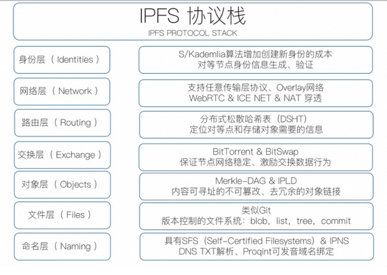
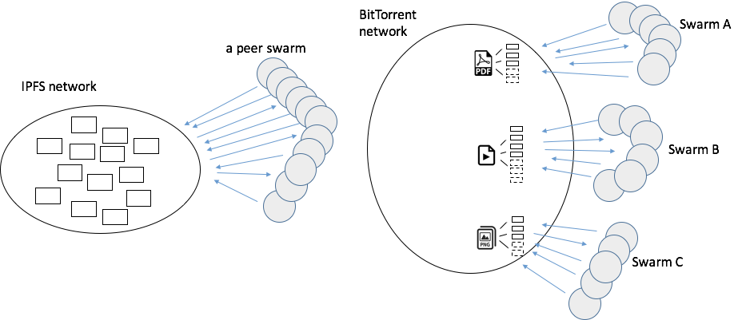
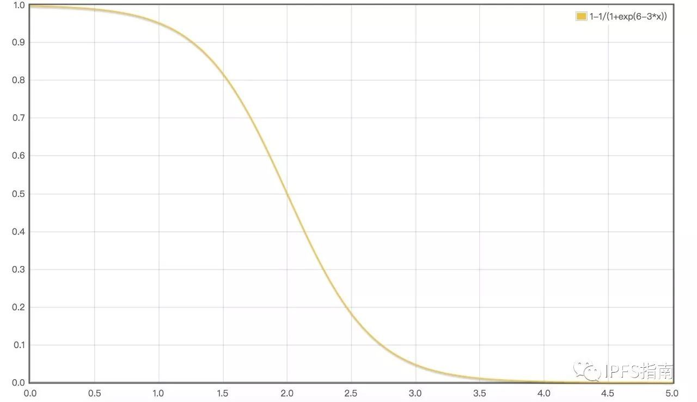
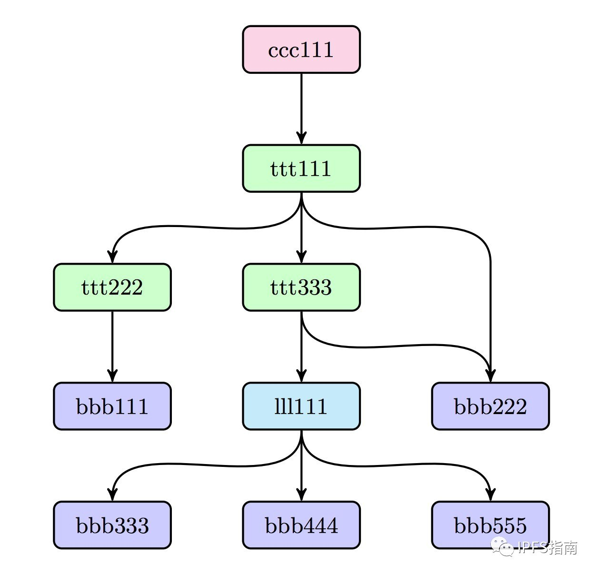

# 调研报告

[TOC]

## 一、项目背景
### 1. 分布式系统的历史
1946 年，第一台电子计算机 ENIAC 诞生在宾夕法尼亚大学，这台计算机占地 170 平米，重达 30 吨，每秒可进行 5000 次加法运算。在 ENIAC 之后，计算机进入了 IBM 主导的时代，IBM 大型机之父吉恩阿姆达尔被认为是有史以来最伟大的计算机设计师之一。大型机凭借着超强的计算和 I/O 处理能力，稳定性，安全性等，在很长的一段时间内引领计算机行业及商业计算领域的发展，而集中式系统架构也成主流。但是随着计算机的发展，这种架构越来越难以适应人们的需求。

从上个世纪八十年代开始，微处理器、局域网和广域网的出现导致了分布式系统的出现。到了九十年代，出现了计算机集群、P2P 和基于网络的计算与服务。到现在，云计算，网格计算也促进了分布式系统的发展。

### 2. 大学生为什么需要一个分布式文件系统？
作为每天生活在同一片蓝天之下的学生们，我们需要的文件有大量是相似甚至是完全一样的。比如一个需要下达的通知文件，再比如同一门课程的同学，甚至是不同年级的，会都需要课程相关的习题集、课本、答案乃至期末考试真题等。

以前，这些文件靠纸张来传递、传承。现在，这些文件多通过社交软件群组来传播。或者 ftp 服务器、科大镜像站 USTC mirror，也都有传递文件的功能。甚至最近因为太过出名而关停的 USTC-CS-Courses-Resource，乃至在匿名的群里交换小道消息与秘密文件的每一个学生，都说明了大学生文件系统有需求，有其存在的必要性与合理性。

当然，上面的例子中前两个与后两个还是有不同的。前面两者中文件发布者是中心化的，而需求的量比较大，需求者众多。而后两者，文件是自由分享下载的，在文件数据流向方面体现出去中心化的特征，有一定的活跃发布者，也存在需求比较特殊的需求者。你在上面分享的实验代码或报告，甚至是课堂笔记乃至读书随笔，都会有人拿来作为参考借鉴，实现了知识更进一步，更加自由的交流与知识传播的去中心化。

这些文件系统都有其自己的缺陷。因为其存储，管理都是中心化的，也就继承了中心化的很多不足。USTC-CS-Courses-Resource 下线之后，所有分享的文件就再也不能访问了，文件就从文件系统里消失了，就算很多文件的备份就静静地躺在同学 PC 的硬盘里，也没法为他人所用，只能在 GitHub 上再建一个仓库，再重新征集文件。这就是中心化文件系统的一大缺陷：中心失效问题。中心服务器可能因为各种各样的原因暂时或永久失效，造成文件暂时不能访问或永远消失。中心服务器采用备份或其他手段抵御故障或攻击，但这样会增加系统的成本。中心化系统还有很多其他缺陷，比如：
  - 初始投入可能比较大，比如需要一个服务器
  - 需要有管理者的不断维护

也许因为这些原因，我们到目前还是没有自己的稳定、普及、廉价的校园文件共享平台。

而一个校园级别的分布式文件系统就比较适合作为上述平台的基石。
  - 每一个学生都是分布式文件系统的一个节点
  - 每一个节点的文件备份都可能为他人所用
  - 每一个节点的地位都是平等的

  - 文件不会轻易丢失

  - 社区性
  - 系统会逐渐成长
  - 容易避免可能的审查
  - 初始投入比较少
  - 节省维护成本
  - 适应节点频繁上下线的情况

下文会在 [与校园文件分享需求的契合](#2.-与校园文件分享需求的契合) 中给出详细论述。

### 3. 分布式存储系统为什么也需要协调？
这一点是我们项目构思设想中最有创新性的一点了。我们最初的想法，是如何在一个像 IPFS 一样的去中心化分布式系统中改进文件的传输效率与存储效率。当然，这两点相比中心化存储已经优秀了很多：
  - 单点故障
  - 单服务器传输

但还有不少问题悬而未决：
  - 分布式存储系统如何决定哪个节点什么时候存储哪一些数据？

    如 IPFS，一个文件发布之后会逐渐扩散到全球的节点上，这时哪些节点存储这个文件会是最高效率或近似最高效率的呢？如果每一个访问过这个文件的节点都保存一份这个文件，这显然是对存储资源的极大浪费；一个网页可能只后都不会再看了。当然，IPFS文件是分块的，如同比特流，那不同块该如何决定存储位置以增强传输效率呢、容错性？

  - 分布式存储系统如何决定一个文件在一个节点上停留多久？

    或者更加细节的问题：文件的需求是动态的，而不是静态的。文件的存储节点应该如何调整？

  - 文件会消失吗？

    IPFS 宣称上传的文件不会消失。但文件发布过去越久，一般需求量就越小。如果分布式存储系统遇到了存储空间不足的情况，该转移/丢弃什么文件呢？

  - 节点是不同的，总有一些节点更加平等，或者说节点之间的差异和多样性。在一个混杂的分布式系统里，每一个节点的存储空间、网速都不一样。

  - 存储与网络性价比--权衡存储与网络开销

## 二、立项依据
### 1. 我们的项目介绍 --- 协调增强的分布式存储系统
我们将以校园内的文件分享需求为基础，搭建一个协调增强的分布式存储系统。蓝图是现有的 IPFS 系统，继承 IPFS 系统的许多特性，并且会对上面提到的问题加以重大改进。比如：
  - 这个分布式文件系统将会实现对文件存储的优化，以提升访问效率。很多文件不需要每个人/节点都存储，只需要在网络里的关键节点分块存储，而这些关键节点显然也是依照节点之间的网速等因素来最优选取的。
    那些离这个文件的需求者群体总体上网速更快的节点、存储空间更大的节点更有可能存储这个文件的一块。

  - 这个系统将会实现对文件存储的动态优化，如果一个文件的热度降低，那存储它的节点也会从网络速度优先的节点转为存储更稳定，便宜，时间更长的节点。如果这个文件的热点群体变了，那么存储它的节点群也会改变。

  - 这个系统将会实现对文件的过期处理。长期不用的文件将会被压缩存入存储空间的死角，即可能是网速最慢、链接最少、存储便宜的节点。如果这个系统存储空间不足，这些文件将会被移除系统/抛弃。

  - 这个系统将会权衡存储与网络的性价比。当网速下降，网络连接减少时，将会增加备份数量。这样可以实现综合效益的最大化。

同时，IPFS上的一些优秀特性也会保留。
  - Git
  - BitTorrent
  - DHT
  - 纠删码

### 2. 与校园文件分享需求的契合
  - Git 提供的强大的版本控制功能与校园文件系统的显示需求不谋而合。一个文件的多个版本不会混淆，远景来看，更为基于我们的分布式文件系统上搭建的协作开发打下了基础，也能实现类似 GitHub 的功能。

与分布式有关的优点：

  - 每一个节点的文件备份都可能为他人所用，相当于利用零碎的分散的存储空间，省去了大量集中的存储空间
  - 每一个节点的地位都是平等的，每一个学生都是文件的分享者和接收者
  - 系统容错性强，文件不会轻易消失

USTC-CS-Courses-Resource 的下线在一定程度上影响了我们的资料获取，让我们不得不再次通过 QQ 分享文件。这个分布式存储系统里一个文件只要还有一个节点有备份，在线就可以访问。

  - 分布式系统节点之间有比较强的数据互动，与学生之间的频繁交流类似，体现出社区的属性，容易在此之上搭建一个活跃的文件共享社区
  - 随着节点的增加，能分享的文件也会增多，吸引更多的学生/节点加入---这个系统会逐渐成长
  - 少投入，建设服务器的初期投入可以免去。
  - 节省维护成本，一个健壮的分布式文件系统与文件分享平台不需要人来管理，而类似的服务器或 USTC-CS-Courses-Resource 项目就需要仓库所有者的维护。
  - 上传下载更加方便

这个是我们希望能实现的目标，使上传下载比其他相似功能的文件分享系统更加方便。

## 三、前瞻与重要性
### 1. 前瞻
这样的分布式文件系统的方便程度将会随节点数量，就是使用者的增长而增加。
  - 吸引更多开发者加入之后，项目上可以开发很多应用，从而进一步优化体验

  - 在此之上可以搭建一个具备上述优点的分布式网盘。

而且这样一套系统也不仅局限于学校，还可以推广到很多类似的情景下，满足类似的需求。
### 2. 重要
  - 这样的一个分布式文件系统显然会提高学生的学习体验。
  - 还可以促进内部交流，增强一个团体的集体感。
### 3. 不足
我们认为这套系统有很大的潜力作为一套局域的，带有特定群体性的文件分享协作系统的基础。

## 四、相关工作
### P2P
Peer-to-Peer（点对点）是分布式程序的结构，用于在对等个体之间合作，每个节点是等同的，没有一个中央服务器。这种网络安排模式不同于通信往往来自中央服务器的客户端--服务器模式。使用客户端--服务器模型的文件传输的典型示例是 FTP 服务，其中客户端和服务器程序是独特的：客户端启动传输，服务器满足这些请求。客户端--服务器模型的优点是：数据的一致性容易控制，系统也容易管理。但是此种模式的缺点十分明显：因为服务器的个数只有一个（即便有多个也非常有限），系统容易出现单一失效点；单一服务器面对众多的客户端，由于CPU能力、内存大小、网络带宽的限制，可同时服务的客户端非常有限，可扩展性差。

#### 网络结构
P2P 网络有 3 种比较流行的组织结构，在 P2P 的不同应用领域发挥着作用。

1. DHT 结构

    分布式哈希表（DHT）是一种功能强大的工具。虽然 DHT 具有各种各样的实现方式，但是具有共同的特征，即都是一个环形拓扑结构，在这个结构里每个节点具有一个唯一的节点标识（ID），节点 ID 是一个 128 位的哈希值。每个节点都在路由表里保存了其他前驱、后继节点的 ID。通过这些路由信息，可以方便地找到其他节点。这种结构多用于文件共享和作为底层结构用于流媒体传输。

2. 树形结构

    在这种结构中，所有的节点都被组织在一棵树中，树根只有子节点，树叶只有父节点，其他节点既有子节点也有父节点。信息的流向沿着树枝流动。最初的树形结构多用于P2P流媒体直播。

3. 网状结构

    在这种结构中，所有的节点无规则地连在一起，没有父子关系。网状结构为 P2P 提供了最大的容忍性、动态适应性，在流媒体直播和点播应用中取得了极大的成功。当网络变得很大时，常常会引入超级节点的概念，超级节点可以和任何一种以上结构结合起来组成新的结构，如 KaZaA。

#### 应用
1. 分布式科学计算

    我们知道，许多计算机的 CPU 资源并不是时刻保持峰值运转的，甚至很多时候计算机处于“空闲”状态，比如使用者暂时离开等情况。而 P2P 技术可以使得众多终端的 CPU 资源联合起来，服务于一个共同的计算。这种计算一般是计算量巨大、数据极多、耗时很长的科学计算。在每次计算过程中，任务（包括逻辑与数据等）被划分成多个片，被分配到参与科学计算的 P2P 节点机器上。在不影响原有计算机使用的前提下，人们利用分散的 CPU 资源完成计算任务，并将结果返回给一个或多个服务器，将众多结果进行整合，以得到最终结果。

    世界最著名的P2P分布式科学计算系统非“SETI@home”项目莫属。SETI@home 项目，由美国加利福尼亚大学伯克利分校在 1999 年发起，是至今最成功的分布式计算项目。SETI@home 通过分析从射电望远镜传来的数据来搜寻地外文明，这在不少科幻迷甚至是很多普通大众眼里都是一个“很酷”的应用。SETI 的早期版本截至 2005 年已经吸引了 543 万用户，分析了大量积压数据。正如宇宙的浩瀚一般，需要计算的数据（即存在宇宙空间的无数无线电信号）也是海量的。可以说，这几百万台终端组成了一个目前最快的高性能计算机都望尘莫及的“超级计算机”。

2. 文件共享

    BitTorrent 是一种依赖 P2P 方式将文件在大量互联网用户之间进行共享与传输的协议。BitTorrent 中的节点在共享一个文件时，首先将文件分片并将文件和分片信息保存在一个 Torrent 文件中。其他用户在下载该文件时根据 Torrent 文件的信息，将文件的部分分片下载下来，然后在其他下载该文件的节点之间共享自己已经下载的分片，从而实现文件的快速分发。由于每个节点在下载文件的同时也在为其他用户上传该文件的分片，所以整体来看，下载的人越多速度就越快。

3. 流媒体直播

    AnySee 是华中科大设计研发的视频直播系统。AnySee 的第一个版本基于树状结构：节目源是一个多播树的根节点，之后的节点被调度为其子节点。每个节点向其父节点索要数据，并将数据提供给多个子节点。这样的结构可以使得节点快速加入到网络中，并且可以根据 IP 邻近原则构建起一棵树，使得节点加入位置都是和自己 IP 邻近的节点，从而优化服务质量。

    之后 AnySee 推出第二个版本，结合了原有的树状结构和流行的网状结构，使得“控制数据走树，媒体数据走网”，既能帮助节点快速定位到加入点，又能实现一定程度的负载均衡，并缓解了原有纯树状结构中底层节点和顶层节点之间播放时差较大的问题。

### IPFS
IPFS 是一种永久的、内容可寻址的、版本化的、点对点的超媒体的分布式存储和传输协议。它的核心是 Merkle 有向无环图，图的链接是哈希值。其目标是补充甚至取代当前的超文本传输协议 --- HTTP，以构建更快、更安全、更自由的互联网环境。IPFS 综合了以前的对等系统的成功想法，包括 DHT，BitTorrent，Git 和 SFS。它将这些技术简化、发展并将成熟的技术连接成一个单一的内聚系统。IPFS 是完全传输中立的，平台上的任何部分都不会存储到一个集中的服务器上，这有利于传输的自由并且保证高速。

#### IPFS 和其它分布式系统
IPFS 结合了以下这些成功的 P2P 系统的特性
- 分布式哈希表，例如 Kademlia DHT

    Kademlia 是一个流行的分布式哈希表，它提供了：
    1. 大规模网络的高效查询：平均查询 $\log_2 n$ 个节点；
    2. 低协调开销：它优化了发送给其他节点的控制消息的数量；
    3. 通过选择长期在线节点来抵抗各种攻击；
    4. 在包括 Gnutella 和 BitTorrent 在内的对等应用中广泛使用，形成了超过 2000 万个节点的网络。

  详解见[参考文献](## 五、参考文献)中相关内容。一张形象图如下：

  ！[](research_for_DFS.assets/1920px-DHT_en.svg.png)

- BitTorrent

    BitTorrent 是一个广泛成功应用的点对点共享文件系统，它可以在存在不信任的对等节点（群集）的协作网络中分发各自的文件数据片。从 BitTorrent 和它的生态系统的关键特征， IPFS 参考了如下特点：
    1. BitTorrent 的数据交换协议使用了一种 bit-for-tat 的激励策略，可以奖励对其他方面做贡献的节点，惩罚只榨取对方资源的节点；
    2. BitTorrent 对等体跟踪文件的可用性，优先发送稀有片段。这减轻了 seeds 节点的负担， 让 non-seeds 节点有能力互相交易；
    3. 对于一些剥削带宽共享策略，BitTorrent的标准tit-for-tat策略是非常脆弱的。然而，PropShare 是一种不同的对等带宽分配策略，可以更好的抵制剥削战略，提高群集的表现。

- 版本控制系统，如 Git

    Git 等版本控制系统提供了很好的文件改动跟踪功能和分发不同版本文件的方法。Git 提供了强大的 Merkle 有向无环图对象模型，它以分布式友好的方式控制文件系统树的变更。
    1. 不可变的对象表示文件（blob），目录（树）和更改（提交）；
    2. 对象通过内容的加密散列进行内容寻址；
    3. 与其他对象的链接是嵌入的，形成了一个 Merkle DAG。这提供了许多有用的完整性和工作流属性；
    4. 大多数版本元数据（分支，标签等）都只是指针引用，因此创建和更新的代价非常小；
    5. 版本变更只是更新引用或者添加对象；
    6. 分发版本变更给其他用户只是简单的传输对象和更新远程引用。

#### IPFS 具体实现
- IPFS 协议栈

	IPFS 协议栈由七层负责不同功能的子协议构成：

  

- IPFS 身份、网络、路由

  所有节点在 IPFS 网络中都要一个唯一的 NodeId 进行标识，其实就是一个公钥的哈希，然而为了增加攻击者的成本，IPFS 使用了 S/Kademlia 中提到的算法增加创建新身份的成本，源码定义如下：

  ```go
  difficulty = <integer parameter>
  n = Node{}
  do {
      n.PubKey,n.PrivKey = PKI.genKeyPair()
      n.NodeId = hash(n.PubKey)
      p = count_preceding_zero_bits(hash(n.NodeId))
  } while (p<difficulty)
  ```

  每一个节点在 IPFS 网络中由 Node 结构体来表示，其中只包含 NodeId 以及一个公私钥对：

  ```go
  type NodeId Multihash
  type Multihash []byte  //子描述加密哈希摘要
  type PublicKey []byte
  type PrivateKey []byte // 子描述的私钥
  type Node struct {
      NodeId NodeID
      PubKey PublicKey
      PriKey PrivateKey
  }
  ```

  IPFS 的网络通信模型是遵循覆盖网络（Overlay Network）的理念设计的。

  IPFS 节点需要一个路由系统，可用于查找：

   - 同伴节点的网络地址。
   - 服务特定对象的对等节点。

  IPFS 路由层数据结构使用的是 S/Kademlia 和 Coral 技术的分布式松散哈希表（DSHT）。

- IPFS 交换层---BitSwap 协议

  > IPFS中BitSwap协议旨在通过对等节点间交换数据块来分发数据，受到BitTorrent技术的启发，每个对等节点在下载的同时不断向其他对等节点上传已下载的数据。和BitTorrent协议不同的是，BitSwap不局限于一个种子文件中的数据块。BitSwap协议中存在一个数据交换市场，这个市场包括各个节点想要获取的所有块数据，这些块数据可能来自文件系统中完全不相关的文件，同时这个市场是由IPFS网络中所有节点组成的。这样的数据市场很需要创造加密数字货币来实现可信价值交换，也就是得有激励层Filecoin。

  - BitSwap 协议的数据结构

  源码结构如下：

  ```go
  type BitSwap struct {
    ledgers map[NodeId]Ledger   //节点账单
    active map[NodeId]Peer      //当前已经连接的对等点
    need_list []Multihash       //此节点需要的块数据校验列表
    have_list []Multihash       //此节点已收到块数据校验列表
  }
  ```

  其中最主要的部分就是need_list 和 want_list，就是节点想要和已有的块列表。两个对等节点通过这两个列表互通有无。可以看出，两个节点都发送BitSwap message消息，节点对等， HTTP request/response 不同。

  IPFS 网络中使用 Bitswap 协议获取数据块一个最大的特点是，请求的数据块是跨文件的，这个是跟 BitTorrent 最大的区别所在，因为在 BitTorrent 中，块请求都是基于文件的，一个 Peer Swarm 都是对同一个文件（目录）进行数据传输。而在 IPFS 中，由于数据请求是基于块的，任何类型的数据块，只要其哈希值一样，都可以拿为己用，一个 Peer Swarm 对应的是整个 IPFS 网络中的数据，因此所有的数据块都可以被用来使用，实现真正的跨文件数据交换。这不仅大大减少了数据的冗余，还大大提高的块检索的效率。显然，BitSwap 的效率比 BitTorrent 更高。

  

  - Design Engine 与信用体系

  对于P2P网络，有一个很重要的问题：如何激励大家分享自己的数据，每一个P2P软件都有自己专属的数据分享策略，IPFS也是如此。

  Decision Engine 是 BitSwap 协议的信用管理模块。它管理一个请求队列，使用一个账本来记录节点之间的传输记录，并以此决定是否响应对端的下载请求。

  值得注意的是，账本，即信用记录是在两个节点之间的。比如，节点 A 向节点 B 发送过数据，那么 A 就拥有对 B 的 Credit，相反，B 欠了 A 的 Debt。如果 A 对 B 拥有的 Credit 超过 Debt，那么下次其向 B 发出 WantList 请求块数据的时候，B 就会立刻反馈数据。据此可以计算节点的负债率（debt ratio，r）和发送率P。

  ```
  debtRatio = bytes_sent/(bytes_recv + 1)

  P (send|r) = 1− 1/(1+exp(6−3r))
  ```

  负债率达到2的时候发送率会急剧下降。如果一个节点只接受数据不分享数据，别人发送给它数据的概率会越来越低。

  

  Decision Engine 会记录下来和其他节点通信的账单（数据收发），可以保持节点间数据交换的历史和防止篡改。当两个节点之间建立连接的时候，BitSwap 会相互交换账单信息，如果账单不匹配，则清除重新记账。恶意节点可能会故意“丢失”账单，以希望清除掉自己的债务。其它交互节点会把这些都记下来，如果总是发生，节点就会被拒绝。

- Merkel DAG ,对象层与文件层

  Merkle DAG 是 IPFS 系统的核心概念之一。Merkle DAG 的全称是 Merkle directed acyclic graph（默克有向无环图）。它是在 Merkle tree 基础上构建的，Merkle tree 是由美国计算机学家 merkle 于1979年申请的专利。

  Merkle DAG拥有如下的功能：

  - 内容寻址：使用多重哈希来唯一识别一个数据块的内容
  - 防篡改：可以方便的检查哈希值来确认数据是否被篡改
  - 去重：由于内容相同的数据块哈希是相同的，可以很容去掉重复的数据，节省存储空间

  可以看出，这些特征和上文中 Bitswap “只要一样的数据块，都为己所用”的特征是密切相关的，因为在 IPFS 看来，其哈希值是完全一样的，就是完全相同的数据块。而这也成为了 IPFS 的重要特征。

  下面介绍文件与块。向 IPFS 上传了一张图片，使用

  ```
  ipfs ls -v <block hash>
  ```

  查看文件分块情况。输出：

  ```shell
  $ ipfs ls -v QmVVQhg7F4h32jVM8moKj54bThYMYsQB25MvEZ6ziaVwBQ
  Hash                                           Size   Name
  QmSDGUhzNAh6ybv5YsikH1h1vDM48fa5y777eUHTw6S3F3 262144
  QmULX45esT6454xEACK1EuseMLVhPgk2LX7no6sXVeaUSA 262144
  QmZghb6Ruec4utFG8dCRxYyfXcFZLGHznj3Kmk2aZpWR8t 262144
  QmQvxZNhSw3upNxL4cpyfRPm4aCnJnj2U1yPnb2kg2LNQc 262144
  QmZdqZMxPz5dLeNHHdWfgvY2GRb41J195jr5Xk5L7HGD5s 195672
  ```

  可见，可以看到文件被分成了15个block。每个block大小时256k（除了最后一个）。
  block的数据结构：

  ```go
  type IPFSLink struct {
  Name string // link 的名字
  Hash Multihash // 数据的加密哈希
  Size int // 数据大小
  }
  Type IPFSObject struct {
  links []IPFSLink // link数组
  data []byte // 数据内容
  }
  ```

  他包含了数据块的数据和到子块的链接。在上例里，文件本身存储在 QmVVQhg7F4h32jVM8moKj54bThYMYsQB25MvEZ6ziaVwBQ 块里，而 ls 命令输出的就是他链接的子块，即文件的全部内容。

  分块之后一块的内容可能和其他已经存在的块相同，在 IPFS 中不区分这两个块，这就体现了块的去重。最后在 IPFS 里所有的块会互相链接形成 DAG ：

  

  便是 Merkel DAG。

  - 直接操作 Merkle DAG

    IPFS可以让我们直接操作Merkle DAG的数据，我们可以完全控制block里面的数据内容和结构，IPFS把Merkle DAG操作权限几乎全部下放给了开发者，开发者可以很容易构造出来自己的数据结构。

  - IPFS是具备可以处理对象级别加密操作的。一个已加密的或者已签名的对象包装在一个特殊的框架里，此框架允许加密和验证原始字节。

  ```go
  type EncryptedObject struct {
	  Object []bytes // 已加密的原始对象数据
  	Tag []bytes    // 可选择的加密标识
  	type SignedObject struct {
  	Object []bytes  // 已签名的原始对象数据
  	Signature []bytes // HMAC签名
  	PublicKey []multihash // 多重哈希身份键值
  }
  ```

  加密操作改变了对象的哈希值，定义一个不同的新的对象。IPFS自动的验证签名以及使用用户指定的钥匙链解密数据。加密数据的links也同样的被保护着，没有解密秘钥就无法遍历对象。也存在着一种现象，可能父对象使用了一个秘钥进行了加密，而子对象使用了另一个秘钥进行加密或者根本没有加密。这可以保证links共享对象安全。

  - IPFS定义了一组对象，用于在Merkle DAG之上对版本化文件系统进行建模。这个对象模型类似于著名版本控制软件Git的数据结构：

    - 块（block）：一个可变大小的数据块。
    - 列表（list）：一个块或其他列表的集合。
    - 树（tree）：块，列表或其他树的集合。
    - 提交（commit）：树的版本历史记录中的快照。

- IPFS 命名层

> IPFS形成了一个内容可寻址的DAG对象，可以在IPFS网络中发布不可更改的数据，甚至可以追踪这些对象的版本历史记录。但这样会存在一个严重的问题，当数据对象的内容更新后，发生改变的还有内容地址的命名。我们需要一种能在易变环境中保持固定命名的方案，为此，IPFS的IPNS星际文件命名系统模块就闪亮登场了。

  - 自验证命名
    使用自验证的命名方案给了我们一种在加密环境下，在全局命名空间中，构架可自行认证名称的方式。模式如下：

    - 通过 NodeId = hash(node.PubKey)，生成IPFS节点信息。
    - 给每个用户分配一个可变的命名空间，由之前生成的节点ID信息作为地址名称，在此路径下： /ipns/ 。
    - 一个用户可以在此路径下发布一个用自己私钥签名的对象，比如说： /ipns/XLF2ip4ii9x0wejs23HD2swlddVmas8kd0Ax/ 。
    - 当其他用户获取对象时，他们可以检测签名是否与公钥和节点信息匹配，从而验证用户发布对象的真实性，达到可变状态的获取。

  - 人类友好名称
    使用哈希寻址大大增加了人类记忆、输入URL的难度。有两种解决方法：
    - 对等节点链接
    用户可以将其他用户节点的对象直接链接到自己的命名空间下。

    - DNS TXT IPNS记录
    在现有的DNS系统中添加TXT记录，这样能够通过域名访问IPFS网络中的文件对象。

再往上便是在 IPFS 基础上搭建的各种应用项目。

#### IPFS 的一些项目
- 星际维基：建立在ipfs上的wikipedia


- 亚历山大:去中心化的内容发布平台
- dtube:利用ipf作为存储的视频分享网站
- ipfs-search:基于ifp来说的搜索引擎
- ipfs-share:基于ifp来说的文件分享
- ipfs.pics:基于ifp来说的图片分享网站

## 五、参考文献
- [IPFS 白皮书](https://github.com/ipfs/papers/raw/master/ipfs-cap2pfs/ipfs-p2p-file-system.pdf)
- [IPFS Documentation](https://docs.ipfs.io/)
- [go-ipfs](https://github.com/ipfs/go-ipfs)
- [IPFS Alpha | Why We Must Distribute The Web](https://www.youtube.com/watch?v=skMTdSEaCtA)
- [简书-IPFS 中的 BitSwap 协议](https://www.jianshu.com/p/f51b9c235ef0)
- [InterPlanetary File System](https://en.wikipedia.org/wiki/InterPlanetary_File_System)
- [分布式哈希表DHT及其变种](https://www.jianshu.com/p/a7a1c25f11a4)
- [Distributed_hash_table](https://en.wikipedia.org/wiki/Distributed_hash_table)
