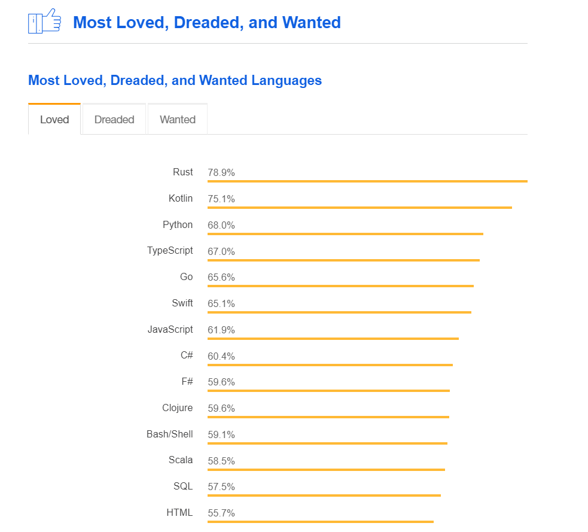
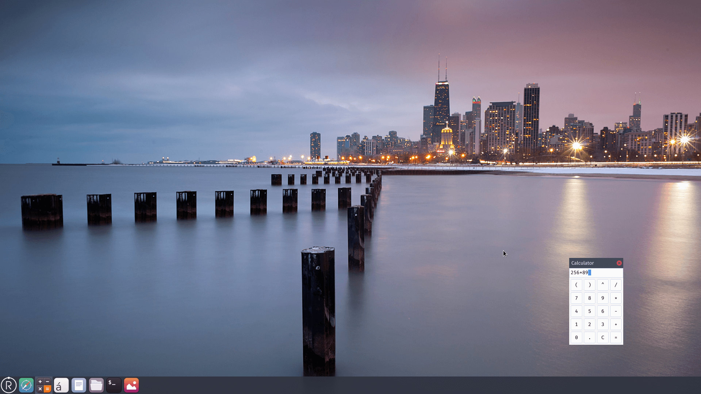
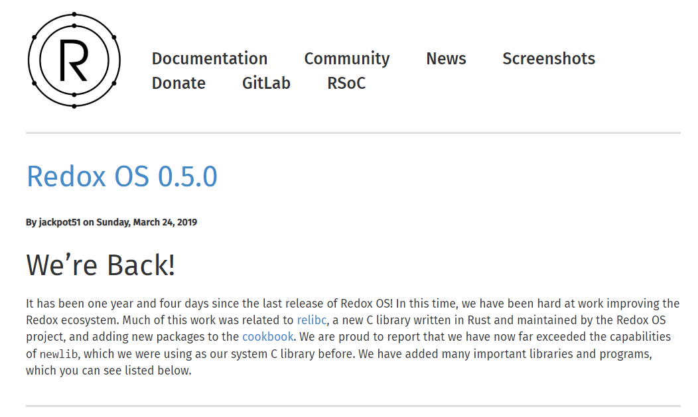

# OS on Raspberry Pi with Rust

## 小组成员

- 刘云飞 PB17051044
- 李维晟 PB17000100
- 汪若辰 PB17000098
- 余磊 PB17051053

## 项目简介

使用 Rust 编程语言写一个能在树莓派上运行的操作系统。

## 项目背景

### 树莓派上的操作系统

树莓派是一种小型、轻量级而功能齐全的嵌入式设备，由于其相对低廉的价格和优质的生态成为了良好的教学用设备和极客们大显身手的舞台。

树莓派的CPU基于ARM架构，运行在其上的操作系统需要针对这种架构和硬件配置做出一定的修改和优化。而许多常见的操作系统都有为树莓派ARM架构专门开发的版本。

其中的一些通用系统简介如下：

- **Raspbian**([homepage](http://www.raspbian.org/))

  树莓派的“官方“通用操作系统。它基于Debian(Linux的一个版本)而特别为树莓派开发。事实上它不仅仅是一个OS，其内部配置了相当多的应用软件，涵盖办公、开发、教育等各个方面。其兼容性和性能非常优秀，是当前树莓派上最实用最广泛的操作系统。

- **Ubuntu Mate**([homepage](https://ubuntu-mate.org/))

  Ubuntu Mate针对树莓派1和2的发行版本，界面个性美观。

- **Ubuntu Snappy Core**([homepage](https://www.ubuntu.com/core))

  Ubuntu针对物联网(IoT)的一个发行版本，兼容树莓派。主要面向开发者。

- **CentOS**([homepage](https://www.centos.org/))

  CentOS针对ARM的发行版，兼容树莓派。

- **Windows 10 IoT**([homepage](https://developer.microsoft.com/en-us/windows/iot))

  Windows针对物联网(IoT)的一个发行版本，兼容Windows 10的桌面风格，兼容树莓派。它不是完整的Windows版本，主要面向开发者。

- **FreeBSD**([homepage](https://www.freebsd.org/)) 

  FreeBSD针对树莓派的发行版。

- **Kali**([homepage](https://www.kali.org/))

  基于Debian的Kali操作系统针对树莓派的发行版。它内置了一系列安全性测试工具，可执行渗透测试，非常适合注重安全性测试的程序员和开发者。

- **Pidora**([homepage](http://www.pidora.ca/))

  在Fedora Remix 基础上针对树莓派优化过的操作系统。

- **Arch Linux**([homepage](https://archlinuxarm.org/))

  Arch Linux针对ARM的发行版，兼容树莓派。其特点为轻量级、使用简单、软件更新速度快。

- **RISC OS**([homepage](https://www.riscosopen.org))

  它基于RISC精简指令集，是相当简洁的操作系统。它比当今的绝大多数操作系统要简单，又具有良好的实时性，但仅支持单用户模式，且在安全性上没有太多保障，还有很大的提升空间。 

可以看出，绝大多数兼容树莓派的操作系统都是原版本针对ARM架构或树莓派本身的发行版，其本身的特性并没有太大的变化，也就是说原来操作系统所具有的弊端依旧会存在。由此我们希望可以针对树莓派本身使用Rust语言开发一个操作系统，从实现的层面上规避许多安全性的问题并对Rust的硬件进行一定程度上的优化工作。

### Rust 编程语言与操作系统

#### Rust 语言简介

Rust 是一个着重于安全性（特别是并发安全）的多重范型编程语言。Rust 在语法上和 C++ 类似，但是能够在保持高性能的同时提供更好的内存安全性。

Rust 由 Mozila Research 的 Graydon Hoare 设计，Dave Herman、Brendan Eich 亦有贡献。

Rust 在 Stack Overflow 的 [2016](https://stackoverflow.com/insights/survey/2016#technology-most-loved-dreaded-and-wanted)、[2017](https://stackoverflow.com/insights/survey/2017#most-loved-dreaded-and-wanted)、[2018](https://insights.stackoverflow.com/survey/2018/#most-loved-dreaded-and-wanted) 年开发者调查中，是“最被喜爱的编程语言”。

#### Why is it Safe?

Rust 编程语言最大的亮点是安全性，正如其官网所说。

> Rust’s rich type system and ownership model guarantee memory-safety and thread-safety — and enable you to eliminate many classes of bugs at compile-time.

Rust 的以下特性保证了它的安全。

##### Memory safety

内存安全是 Rust 的一个设计目标，它不允许在 Safe Rust（和它相对的是 Unsafe Rust，Rust 默认运行方式是前者）中出现空指针、野指针和数据竞争。

#### 当前基于 Rust 的 OS 的对比分析

当前基于 Rust 的操作系统主要有以下这些。（数据来源：[flosse/rust-os-comparison: A comparison of operating systems written in Rust](https://github.com/flosse/rust-os-comparison)）

- **redox**             ([repository](https://github.com/redox-os/redox) / [homepage](http://www.redox-os.org/))

- **Tock**              ([repository](https://github.com/helena-project/tock) / [homepage](http://www.tockos.org/))

- **intermezzOS**       ([repository](https://github.com/intermezzos/kernel) / [homepage](http://intermezzos.github.io/))

- **reenix**            ([repository](https://github.com/scialex/reenix))

- **rustboot**          ([repository](https://github.com/charliesome/rustboot))

- **RustOS**            ([repository](https://github.com/ryanra/RustOS))

- **QuiltOS**           ([repository](https://github.com/QuiltOS/QuiltOS))

- **Tifflin (rust_os)** ([repository](https://github.com/thepowersgang/rust_os))

- **bkernel**           ([repository](https://github.com/rasendubi/bkernel))

- **Quasar**            ([repository](https://github.com/LeoTestard/Quasar))

- **SOS**               ([repository](https://github.com/hawkw/sos-kernel))

这些操作系统的对比如下表。

| Name            | Architectures   | Pure Rust                | Active? | Kernel architecture        | Target           | Userpace? | Optional GUI? | Contributors | Filesystem  | License                    |
|-----------------|-----------------|--------------------------|---------|----------------------------|------------------|-----------|---------------|--------------|-------------|----------------------------|
| **redox**       | x86 and x86_64  | yes                      | yes     | Microkernel                | General purpose  | yes       | yes           | 50           | [ZFS]/[RedoxFS] | MIT                        |
| **Tock**        | Cortex M        |                          | yes     |                            |                  |           | no            | 40           |             | APL 2 / MIT                |
| **intermezzOS** | x86_64          | no                       | yes     | ?                          | PoC              | no        | no            | 18           | no          | APL 2 / MIT                |
| **RustOS**      | i386            | ?                        | yes     | None                       | PoC              | no        | no            | 10           | no          | APL 2 / MIT                |
| **rustboot**    | i386            | ?                        | no      | None                       | PoC              | no        | no            | 8            | no          | MIT                        |
| **bkernel**     | ARM             | yes                      | yes     | ?                          | Embedded devices | no        | no            | 4            | ?           | GPL with linking exception |
| **SOS**         | x86_64          | yes                      | yes     | Microkernel                | PoC              | no        | no            | 3            | ?           | MIT                        |
| **reenix**      | [Brown's CS167/9] | no                       | no      | Monolithic (current state) | PoC              | no        | no            | 3            | ?           | [unknown]                  |
| **Quasar**      | x86_64          | ?                        | no      | ?                          | ?                | no        | no            | 2            | ?           | ?                          |
| **Tifflin**     | x86_64/amd64    | almost                   | yes     | Monolithic                 | ?                | ?         | yes           | 1            | ISO9660     | 2-Clause-BSD               |

#### Redox OS

在众多基于 Rust 的操作系统中，Redox OS 当之无愧是目前最成熟的操作系统之一，基于此，我们选择它做简要介绍。

在 [Redox OS 官网](https://www.redox-os.org/)上，开发者对其的介绍如下。

> **Redox** is a Unix-like Operating System written in [**Rust**](https://www.rust-lang.org/), aiming to bring the innovations of Rust to a modern microkernel and full set of applications.

Redox 有以下特点。

- Rust 语言实现
- 微内核设计
- 包括可选的 GUI 程序 - Orbital
- 支持 Rust 标准库
- MIT 授权
- 驱动运行在用户空间
- 包括常见的 Unix 命令
- C 程序的新移植库

Redox 的桌面环境 Orbital 也有着成熟、现代的 UI 设计，截图如下。

Redox 不仅仅是个内核，而是个全功能的操作系统，它提供了内存分配器、文件系统、显示管理器等扩展，和内核本身共同构成了一个实用、便捷的操作系统生态。某种意义上可以把它理解成基于内存安全的编程语言的、加上一些现代技术的 GNU 或 BSD 生态。（译自<https://github.com/redox-os/redox>）

就在几天前（2019年3月24日），[Redox OS 0.5.0](https://www.redox-os.org/news/release-0.5.0/) 发布。

新的 Redox OS 将 Relibc 用做默认 C 语言库（Relibc 是一个用 Rust 编程语言编写的C语言库的实现）。Redox OS 0.5 还包括对其事件系统的改进、完成对 Pthreads 的支持、对 LLVM 和使用 LLVM 的项目（如Mesa 和 LLVMpipe）的更好支持、对 EFI 的改进等等。（引自 [Redox OS 0.5发布](https://www.linuxidc.com/Linux/2019-03/157707.htm)）

## 立项依据

#### 1.项目名称：基于Rust语言开发、可在树莓派机器上运行的操作系统

#### 2.项目介绍

如名称所示，我们希望利用Rust在语法上内禀的安全性来尝试开发一个较为完整的操作系统，并使之可以在树莓派3B+机器上正常运行。

总体上，我们的项目涉及到两个方面：

- 使用Rust语言进行操作系统的开发。操作系统有几大基本组成部分：进程调度、内存管理、文件系统、设备驱动等。这些方面都应当纳入我们的考虑当中。特别地，操作系统的方方面面都涉及到安全性的问题。而Rust不仅具有像C++那样的执行时高效率，且其在语法上的严苛性能够保证在开发层面上避免许多的操作系统安全性漏洞，使用它作为开发的语言是一个比较好的选择。
- 在树莓派机器上运行操作系统，这涉及到对树莓派硬件的理解。为了使我们设计的操作系统能够在树莓派机器上运行，其还要针对机器的ARM架构和硬件驱动程序接口进行设计，这也是该项目的重难点之一。

我们会将目标操作系统的安全性与其在树莓派上的运行作为首要的关注点。

#### 3.项目依据与预期

如背景中所介绍，有许多基于ARM架构的操作系统可以在树莓派上运行，也有一些着眼于Rust的安全性而实现的操作系统问世，不过目前能综合两者，即在树莓派这类嵌入式设备上运行的基于Rust的操作系统还很少。我们认为可以汲取这些开发者的经验和课本上学习的操作系统知识，将其用于我们的Rust的系统实现。

通过完成该项目，我们能够

- 实现一个小的操作系统内核，针对其在树莓派机器上的运行做相关方面的性能测试，并与其它同类型系统进行比较。
- 在该操作系统内核上实现一些简单的系统调用，使其具有一般通用操作系统的基本功能。
- 活用所学习的知识，深入理解操作系统的概念与原理。
- 熟练掌握Rust语言的开发技术。

## 前瞻性分析

### 安全性

Rust 语言自身的特点使得基于其的 OS 更安全。

## 参考资料

- [Stanford CS140e - Operating Systems](https://cs140e.sergio.bz/)

- [Rust Documentation](https://doc.rust-lang.org/stable/)

- [Writing an OS in Rust](https://os.phil-opp.com/)

- [rust-embedded/rust-raspi3-OS-tutorials: Rust bare-metal and OS tutorials on the Raspberry Pi 3](https://github.com/rust-embedded/rust-raspi3-OS-tutorials)

- [Stanford: An experimental course on operating systems](https://www.reddit.com/r/cs140e/)
